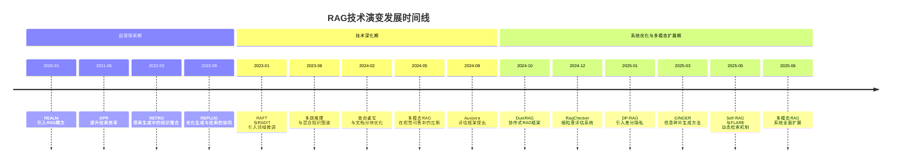
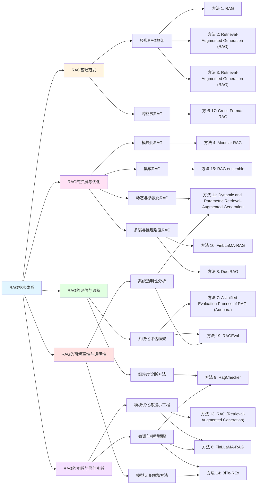

F:\ProgramData\anaconda3\python.exe G:\Projects\literature-review-api\examples\generate_from_query_request.py 
POST http://192.168.30.10:8003/api/v1/literature/generate-from-query
payload: {"research_topic": "检索增强生成技术研究", "max_papers": 20, "enable_thinking": true, "use_service": true, "plan": "检索增强生成背景、数据集、方法以及未来综述"}
[1] section=init progress=1 message=正在理解研究需求并执行任务: 检索增强生成技术研究
[2] section=background progress=1 message=正在生成研究背景分析部分的写作规划
[3] section=background progress=1 message=
根据"检索增强生成技术研究"进行相关论文文献检索

[4] section=background progress=2 message=
共搜索到与"检索增强生成技术研究"相关的论文文献20篇

[5] section=background progress=3 message=
正在理解文献内容，开始生成研究背景部分的写作大纲

[6] section=background progress=4 message=
研究背景部分写作大纲生成完毕

[7] section=background progress=5 message=
正在提取与"检索增强生成技术研究"相关的20篇论文文献正文内容

[8] section=background progress=6 message=
开始选择相关论文章节进行背景综述生成

[9] section=background progress=7 message=
开始按照查询词"检索增强生成技术研究"进行章节选择

[10] section=background progress=8 message=
共选择了与"检索增强生成技术研究"相关的论文文献15篇，用于进行章节选择

[11] section=background progress=10 message=
论文章节选择成功

[12] section=background progress=11 message=
开始进行论文重要模块信息抽取，包括标题、摘要、方法、场景等

[13] section=background progress=12 message=
正在提取与"检索增强生成技术研究"相关的15篇论文文献正文内容

[14] section=background progress=0 message=正在从服务生成background部分内容
[15] section=background progress=0 message=正在从服务生成background部分内容
[16] section=background progress=13 message=
论文信息抽取成功，开始生成研究背景综述章节

[17] section=background progress=14 message=
开始针对"检索增强生成技术研究"查询词，结合搜索的15篇文献，进行背景综述内容生成

[18] section=background progress=0 message=正在从服务生成background部分内容
[19] section=background progress=20 message=
结合15篇文献，针对"检索增强生成技术研究"主题，完成研究背景内容生成

[20] section=None progress=None message=None
[21] section=background progress=20 message=background部分大纲和内容生成完成
[22] section=dataset progress=21 message=正在生成数据集以及指标分析部分的写作规划
[23] section=dataset progress=21 message=
根据"检索增强生成技术研究"进行相关论文文献检索

[24] section=dataset progress=22 message=
共搜索到与"检索增强生成技术研究"相关的论文文献20篇

[25] section=dataset progress=23 message=
正在理解文献内容，开始生成数据集部分的写作大纲

[26] section=dataset progress=24 message=
数据集部分写作大纲生成完毕

[27] section=dataset progress=25 message=
正在提取与"检索增强生成技术研究"相关的20篇论文文献正文内容

[28] section=dataset progress=26 message=
开始选择相关论文章节进行数据集综述生成

[29] section=dataset progress=27 message=
开始按照查询词"检索增强生成技术研究"进行章节选择

[30] section=dataset progress=20 message=正在从服务生成dataset部分内容
[31] section=dataset progress=28 message=
共选择了与"检索增强生成技术研究"相关的论文文献16篇，用于进行章节选择

[32] section=dataset progress=29 message=
论文章节选择成功

[33] section=dataset progress=30 message=
开始进行论文重要模块信息抽取，包括数据集、实验、评测等

[34] section=dataset progress=20 message=正在从服务生成dataset部分内容
[35] section=dataset progress=31 message=
论文信息抽取成功，开始生成数据集综述章节

[36] section=dataset progress=32 message=
开始针对"检索增强生成技术研究"查询词，结合搜索的9篇文献，进行数据集综述内容生成

[37] section=dataset progress=33 message=
开始构建与"检索增强生成技术研究"主题相关的数据集分类体系

[38] section=dataset progress=20 message=正在从服务生成dataset部分内容
[39] section=dataset progress=20 message=正在从服务生成dataset部分内容
[40] section=dataset progress=20 message=正在从服务生成dataset部分内容
[41] section=dataset progress=34 message=
开始生成数据集综述大纲

[42] section=dataset progress=20 message=正在从服务生成dataset部分内容
[43] section=dataset progress=35 message=
开始生成"检索增强生成技术研究数据集综述简介"章节内容

[44] section=dataset progress=36 message=
开始生成"检索增强生成技术研究数据集分类体系"章节内容

[45] section=dataset progress=37 message=
开始生成"各类别数据集深度分析"章节内容

[46] section=dataset progress=38 message=
开始生成"对比分析与发展总结"章节内容

[47] section=dataset progress=20 message=正在从服务生成dataset部分内容
[48] section=dataset progress=20 message=正在从服务生成dataset部分内容
[49] section=dataset progress=20 message=正在从服务生成dataset部分内容
[50] section=dataset progress=20 message=正在从服务生成dataset部分内容
[51] section=dataset progress=20 message=正在从服务生成dataset部分内容
[52] section=dataset progress=20 message=正在从服务生成dataset部分内容
[53] section=dataset progress=20 message=正在从服务生成dataset部分内容
[54] section=dataset progress=40 message=
结合9篇文献，针对"检索增强生成技术研究"主题，完成数据集内容生成

[55] section=None progress=None message=None
[56] section=dataset progress=40 message=dataset部分大纲和内容生成完成
[57] section=method progress=41 message=正在生成研究方法分析部分的写作规划
[58] section=method progress=41 message=
根据"检索增强生成技术研究"进行相关论文文献检索

[59] section=method progress=42 message=
围绕方法、技术、算法等主题，共搜索到与"检索增强生成技术研究"相关的论文文献20篇

[60] section=method progress=43 message=
正在理解文献内容，开始生成研究方法部分的写作大纲

[61] section=method progress=44 message=
研究方法部分写作大纲生成完毕

[62] section=method progress=45 message=
正在提取与"检索增强生成技术研究"相关的20篇论文文献正文内容

[63] section=method progress=46 message=
开始选择相关论文章节进行方法综述生成

[64] section=method progress=47 message=
开始按照查询词"检索增强生成技术研究"进行章节选择

[65] section=method progress=40 message=正在从服务生成method部分内容
[66] section=method progress=48 message=
共选择了与"检索增强生成技术研究"相关的论文文献19篇，用于进行章节选择

[67] section=method progress=49 message=
论文章节选择成功

[68] section=method progress=50 message=
开始进行论文重要模块信息抽取，包括方法名称、核心思想、技术路线等

[69] section=method progress=51 message=
正在提取与"检索增强生成技术研究"相关的19篇论文文献正文内容

[70] section=method progress=40 message=正在从服务生成method部分内容
[71] section=method progress=40 message=正在从服务生成method部分内容
[72] section=method progress=52 message=
论文信息抽取成功，开始生成研究背景综述章节

[73] section=method progress=53 message=
开始针对"检索增强生成技术研究"查询词，结合搜索的19篇文献，进行方法综述内容生成

[74] section=method progress=54 message=
论文信息抽取成功，开始生成研究方法综述章节

[75] section=method progress=40 message=正在从服务生成method部分内容
[76] section=method progress=40 message=正在从服务生成method部分内容
[77] section=method progress=40 message=正在从服务生成method部分内容
[78] section=method progress=40 message=正在从服务生成method部分内容
[79] section=method progress=40 message=正在从服务生成method部分内容
[80] section=method progress=40 message=正在从服务生成method部分内容
[81] section=method progress=40 message=正在从服务生成method部分内容
[82] section=method progress=60 message=
结合19篇文献，针对"检索增强生成技术研究"主题，完成方法综述内容生成

[83] section=None progress=None message=None
[84] section=method progress=60 message=method部分大纲和内容生成完成
[85] section=future progress=61 message=正在生成未来与挑战部分的写作规划
[86] section=future progress=61 message=
根据"检索增强生成技术研究"进行相关论文文献检索

[87] section=future progress=62 message=
共搜索到与"检索增强生成技术研究"相关的论文文献20篇

[88] section=future progress=63 message=
正在理解文献内容，开始生成未来发展部分的写作大纲

[89] section=future progress=64 message=
未来发展部分写作大纲生成完毕

[90] section=future progress=65 message=
正在提取与"检索增强生成技术研究"相关的20篇论文文献正文内容

[91] section=future progress=66 message=
开始选择相关论文章节进行未来发展综述生成

[92] section=future progress=67 message=
开始按照查询词"检索增强生成技术研究"进行章节选择

[93] section=future progress=68 message=
共选择了与"检索增强生成技术研究"相关的论文文献17篇，用于进行章节选择

[94] section=future progress=69 message=
论文章节选择成功

[95] section=future progress=70 message=
开始进行论文重要模块信息抽取，包括挑战、未来方向、应用场景等

[96] section=future progress=71 message=
正在提取与"检索增强生成技术研究"相关的17篇论文文献正文内容

[97] section=future progress=60 message=正在从服务生成future部分内容
[98] section=future progress=60 message=正在从服务生成future部分内容
[99] section=future progress=60 message=正在从服务生成future部分内容
[100] section=future progress=60 message=正在从服务生成future部分内容
[101] section=future progress=72 message=
论文信息抽取成功，共抽取到14个挑战、14个未来方向、15个应用场景

[102] section=future progress=73 message=
开始构建与"检索增强生成技术研究"主题相关的未来研究方向分类体系

[103] section=future progress=60 message=正在从服务生成future部分内容
[104] section=future progress=75 message=
开始生成未来发展综述章节内容

[105] section=future progress=60 message=正在从服务生成future部分内容
[106] section=future progress=76 message=正在优化润色内容
[107] section=future progress=60 message=正在从服务生成future部分内容
[108] section=future progress=78 message=优化润色内容完成
[109] section=future progress=80 message=
结合17篇文献，针对"检索增强生成技术研究"主题，完成未来发展内容生成

[110] section=None progress=None message=None
[111] section=future progress=80 message=future部分大纲和内容生成完成
[112] section=all progress=100 message=完整文献综述生成完成
# 检索增强生成技术的理论与应用研究

**摘 要**：检索增强生成（Retrieval-Augmented Generation, RAG）技术通过引入外部知识源，为大型语言模型（LLMs）提供了动态获取和整合信息的能力，有效缓解了其因依赖静态训练数据而引发的知识过时、生成幻觉和领域适应性不足等问题。本文系统回顾了RAG技术的发展历程，梳理其从概念提出到方法创新再到系统优化的演进路径，并分析其在问答、摘要和对话生成等任务中的核心价值。在数据集方面，构建了一个多维分类体系，涵盖通用与特定领域任务、检索与生成复杂度等多个维度，揭示了当前评估数据在多样性与可扩展性方面存在的不足。方法层面，本文总结了RAG的基础范式及其在多模态融合、动态检索、模块化设计等方面的扩展优化，强调其在提升生成质量与系统可解释性方面的作用。最后，探讨了RAG在跨模态语义对齐、系统性能优化和实际部署中的关键挑战，并提出未来应加强统一表示空间构建与高效系统架构设计，以推动RAG技术在金融、医疗、法律等知识密集型领域的广泛应用与深度落地。

**关键词**：检索增强生成（RAG）,知识密集型任务,多模态融合,系统优化,生成质量,动态检索,模型可解释性,领域适应性
# 1.从知识瓶颈到动态检索的范式演进

检索增强生成（RAG）技术的提出与发展，源于大型语言模型在静态知识库限制下所面临的生成幻觉与知识过时问题。早期基于纯生成模型的方法难以实时获取最新或领域特定信息，促使研究者引入外部检索机制以增强模型的动态知识获取能力。这一转变不仅标志着从封闭式生成到开放式检索生成的技术演进，也体现了人工智能系统在知识表示与信息整合方面的范式转换。本章节系统梳理了RAG技术的历史发展脉络，分析其在模型架构、检索策略与生成机制等方面的理论基础与关键技术突破，揭示其作为连接模型内部知识与外部信息的核心桥梁所具有的重要研究价值与应用前景，为后续探讨其优化方法与挑战奠定基础。

## 1.1 检索增强生成技术的定义和范围

检索增强生成（Retrieval-Augmented Generation, RAG）是一种通过结合外部知识检索与语言生成能力，以增强大型语言模型（LLM）在事实准确性、上下文相关性及领域适应性方面的技术范式。其核心思想在于利用外部文档或知识库中的信息作为生成过程的补充输入，从而缓解LLM因训练数据静态、知识过时或领域知识不足而导致的生成偏差与幻觉问题。RAG的工作流程通常包括预检索、检索、后检索和生成四个阶段，分别涉及索引构建、查询优化、检索结果重排序与内容融合等关键技术18。在生成过程中，模型不仅依赖其内部知识，还通过检索器从外部知识源中获取相关信息，再由生成器整合并输出最终结果。这种机制使得RAG在问答、摘要、对话生成、个性化推荐等任务中展现出显著优势，尤其是在需要实时更新或高度专业化的场景中26。已有研究表明，RAG能够有效提升模型的可信度与实用性，同时为解决LLM在复杂推理、多文档整合和多模态知识融合中的局限性提供了可行路径410。

与传统的LLM生成方法相比，RAG在知识来源、生成质量与系统灵活性方面具有明显差异。传统生成模型主要依赖训练数据中的静态知识，难以应对动态变化或领域特定的信息需求，而RAG通过引入外部检索机制，使模型能够在生成过程中动态获取最新或更相关的知识，从而提升输出的准确性与时效性12。此外，RAG还与知识图谱增强、微调模型等方法形成互补关系。例如，知识图谱增强通常依赖结构化数据，适用于逻辑推理任务，而RAG更适用于开放域、非结构化文本的生成场景；微调模型虽然能提升特定领域的表现，但需要重新训练模型参数，成本较高，而RAG则在不更新模型权重的前提下实现知识扩展，具有更高的部署效率315。近年来，研究者还提出了多种RAG的变体，如动态RAG、参数化RAG和协作式RAG，分别在检索时机、知识整合方式和多模型协同方面进行了创新103。这些方法进一步拓展了RAG的适用边界，使其能够应对更复杂的任务需求，如多跳推理、跨文档整合与多模态生成612。

在应用范围与技术边界方面，RAG技术已广泛应用于多个知识密集型领域，包括问答系统、对话生成、摘要生成、法律咨询、医疗诊断、金融分析等。其优势在于能够快速适应新领域，通过构建或接入外部知识库，使模型在无需重新训练的情况下生成高质量、可解释的输出26。例如，在医疗领域，RAG可用于辅助医生进行诊断建议生成，确保信息来源的权威性与可追溯性；在法律领域，RAG系统能够从大量判例中检索相关信息，支持法律推理与文书生成312。技术边界方面，RAG的性能受限于检索器与生成器之间的对齐程度、检索效率、上下文融合能力以及系统的可扩展性。当前研究普遍关注如何提升检索的准确性与效率，如通过查询重写、文档分块优化、嵌入模型对比学习等手段58。同时，多模态RAG系统也逐渐成为研究热点，旨在融合文本、图像、音频等多类型信息，以支持更丰富的生成任务1012。然而，RAG在处理长文本、跨文档推理及隐私保护方面仍面临挑战，尤其是在涉及敏感数据的应用中，如何在不牺牲生成质量的前提下实现差分隐私保护，成为亟待解决的问题15。

## 1.2 检索增强生成技术的历史背景和技术演变

检索增强生成（Retrieval-Augmented Generation, RAG）技术的演进反映了大型语言模型（LLM）在应对知识过时、生成幻觉和领域适应性差等问题上的持续探索与创新。其发展历程可划分为几个关键阶段，每个阶段都伴随着技术方法的优化、应用场景的扩展以及评估体系的完善。从最初将外部知识检索与生成过程简单结合，到如今融合多跳推理、动态检索、参数化知识注入和隐私保护等复杂机制，RAG技术逐步从辅助手段演变为LLM系统中不可或缺的核心组件。这一演变不仅推动了模型在事实准确性与上下文理解方面的提升，也促进了其在医疗、法律、金融等高风险领域的广泛应用。

**起源与初步探索阶段（2020年-2022年）**  
RAG技术的起源可以追溯到大型语言模型在开放域问答和对话系统中暴露出的知识局限性。早期的研究主要集中在如何通过引入外部知识库来增强模型的生成能力，以减少其对训练数据的依赖。例如，REALM（Retrieval-Augmented Language Model Pre-training）2 提出了一种联合训练的框架，将检索过程与生成过程结合，使得模型在生成时能够动态查询外部知识源。这一阶段的研究奠定了RAG的基本结构，即“检索器-生成器”双模块架构，其中检索器负责从外部知识库中获取相关信息，生成器则基于检索结果生成自然语言输出。DPR（Dense Passage Retrieval）2 和 BM25 等检索方法也被广泛应用于这一框架中，以提升检索的效率和相关性。此外，一些初步的RAG系统如 RETRO 和 REPLUG 开始探索如何在生成过程中引入外部知识，以增强模型的上下文理解能力3。这些早期工作为后续RAG技术的发展提供了理论基础和技术路径，同时也揭示了在知识检索与生成融合过程中存在的挑战，如检索结果与生成内容的对齐问题、计算开销的增加等1。

**技术深化与多样化发展阶段（2022年-2024年）**  
随着RAG技术的逐步成熟，研究者开始关注其在不同任务中的适应性与优化策略。这一阶段的显著特点是技术方法的多样化和系统性能的提升。例如，RAFT 和 RADIT 等方法通过引入领域特定的微调策略，增强了模型在特定任务中的表现3。同时，多跳推理（multi-hop reasoning）成为研究热点，旨在解决复杂问题中需要跨多个文档进行信息整合的挑战。相关工作如多阶段优化和混合知识图谱与向量检索的方法，展示了RAG在处理跨文档、结构化内容和长文本任务中的潜力6。此外，研究者开始系统性地探索RAG的最佳实践，如查询重写、伪文档生成、文档分块优化、嵌入模型对比学习等技术5。这些方法不仅提升了检索的准确性，也增强了生成器对上下文的理解能力。与此同时，评估体系的构建也逐步完善，研究者提出了多种评估指标和框架，以全面衡量RAG系统的性能13。这一阶段的研究表明，RAG技术在提升生成模型的事实准确性、减少幻觉和增强领域适应性方面具有显著优势，但也暴露出模块间对齐、计算效率和伦理风险等关键问题2。

**系统优化与多模态扩展阶段（2024年-2025年至今）**  
进入2024年后，RAG技术的研究重点转向系统优化与多模态扩展，以应对更复杂和多样化的应用场景。一方面，研究者致力于提升RAG系统的效率与鲁棒性。例如，DuetRAG 提出了一种协作式RAG框架，通过引入仲裁模型来选择最终答案，从而有效结合内部知识与外部文档，提升模型在复杂问题上的鲁棒性3。另一方面，多模态RAG系统开始受到关注，旨在将文本、图像、音频等多类型信息整合到生成过程中。相关工作如多模态检索技术在视觉问答中的应用，展示了RAG在跨模态任务中的潜力5。此外，隐私保护也成为RAG系统设计的重要考量。DP-RAG 通过在文档检索和生成过程中引入差分隐私机制，有效减少了敏感信息泄露的风险，为RAG在医疗、金融等高隐私要求领域的应用提供了保障15。与此同时，RAG系统的评估方法也得到了进一步发展，RagChecker 通过声明级蕴含检查，提供了对检索和生成过程的细粒度诊断，显著提升了评估的可靠性和实用性7。这些进展表明，RAG技术正朝着更高效、更智能和更安全的方向发展，其在复杂推理、多模态生成和隐私保护等领域的应用前景广阔610。

RAG技术的演变时间线清晰地展现了其从概念提出到系统优化的完整发展过程。早期的探索为RAG奠定了基础，中期的技术深化推动了其在复杂任务中的应用，而近期的系统优化与多模态扩展则进一步拓展了其适用范围和性能边界。这一技术路径不仅反映了研究者对生成模型知识局限性的深刻理解，也体现了RAG在提升模型实用性与可信度方面的持续创新。

## 1.3 检索增强生成技术的重要性和实际意义

检索增强生成（Retrieval-Augmented Generation, RAG）技术作为连接大规模语言模型（LLM）与外部知识源的关键桥梁，正在多个关键领域展现出深远的变革性影响和实际价值。该技术通过引入外部文档或知识库信息，显著提升了生成模型的事实准确性、上下文相关性以及对特定领域任务的适应能力。在当前LLM面临知识过时、幻觉生成和领域泛化能力不足等挑战的背景下，RAG提供了一种动态、灵活且可扩展的解决方案，使得模型能够在不依赖内部知识更新的前提下，持续适应新数据和新任务。此外，随着多模态数据的广泛应用，RAG技术也在不断拓展其能力边界，为视觉问答、跨模态推理等任务提供了新的研究方向。因此，深入研究RAG不仅有助于推动自然语言处理技术的发展，也为实际应用中的知识密集型任务提供了坚实的技术支撑124。

**在提升生成模型的事实准确性与减少幻觉方面**，RAG技术具有显著的学术与应用价值。大型语言模型虽然具备强大的语言生成能力，但其内部知识库的静态性导致在处理时效性强或领域特定的问题时容易产生幻觉，即生成与事实不符的内容。RAG通过引入外部检索机制，使模型能够实时获取最新或更准确的信息，从而在生成过程中进行事实校验和内容增强。例如，DuetRAG通过结合微调模型与RAG方法，并引入仲裁机制，有效提升了在领域特定问答任务中的鲁棒性和准确性3。此外，RagChecker提出了一种细粒度的评估框架，通过声明级的蕴含检查，揭示了RAG系统在检索与生成过程中的错误来源，进一步验证了RAG在减少幻觉方面的有效性7。研究表明，RAG不仅能够提升生成内容的准确性，还能增强模型的可信度，使其在医疗、法律、金融等高风险领域中具备更强的实用性610。

**在支持特定领域任务与促进个性化内容生成方面**，RAG技术展现出广泛的实际应用潜力。在医疗诊断、法律咨询和金融分析等专业领域，模型需要依赖准确、权威的知识来源来生成可靠的输出。传统LLM由于训练数据的局限性，往往难以满足这些领域对知识深度和专业性的要求。而RAG通过引入外部知识库，使得模型能够在生成过程中动态调用相关文档，从而提升回答的专业性和可靠性。例如，Hybrid RAG系统通过多阶段优化策略，在复杂推理任务中显著提升了模型的表现，尤其在法律和金融等需要多跳推理的场景中8。此外，基于信息碎片的RAG方法GINGER通过模块化设计，有效提取并整合关键信息，生成结构清晰、来源明确的回答，为构建可追溯的对话系统提供了新思路12。在个性化内容生成方面，RAG技术能够根据用户需求动态检索相关数据，生成定制化的内容，广泛应用于推荐系统、智能客服和个性化教育等场景25。通过结合用户行为数据与外部知识，RAG系统能够提供更贴合用户需求的响应，从而提升用户体验和系统满意度9。

**在优化系统效率与推动技术普及方面**，RAG技术同样具有重要的现实意义。随着LLM在实际场景中的大规模部署，系统的计算开销和响应速度成为制约其应用的重要因素。RAG通过引入高效的检索机制和模块化设计，能够在不更新模型参数的前提下，实现知识的动态扩展与任务的灵活适配。例如，NinjaLLM通过低成本微调和高效推理部署，显著提升了RAG系统的性能，降低了计算资源的消耗，使其更适用于大规模应用9。此外，RAGTrace通过交互式可视化手段，揭示了检索与生成之间的动态关系，为系统优化提供了直观的诊断工具11。在评估方面，Auepora框架提出了统一的评估流程，系统性地分析了RAG在检索、生成和整体表现中的关键指标，为未来研究提供了标准化的评估方法13。这些优化不仅提升了RAG系统的实用性，也推动了其在资源受限环境中的部署，如边缘计算、移动设备和低带宽网络等场景10。同时，RAG技术的模块化特性使其易于集成到现有系统中，降低了技术落地的门槛，为中小企业和非技术背景用户提供了更多可能性14。

检索增强生成技术的重要性和实际意义不仅体现在其对生成模型性能的提升上，更在于其对知识密集型任务的支撑、对隐私与伦理问题的应对以及对技术普及的推动。随着RAG在多跳推理、多模态整合和动态知识更新等方面的研究不断深入，其在问答、对话、推荐、法律、医疗等领域的应用前景愈发广阔。DP-RAG等隐私保护方法的提出，也使得RAG在处理敏感数据时具备更强的合规性和安全性15。未来，RAG技术有望在更复杂的任务中实现更高效的知识整合与生成控制，同时通过更智能的检索机制和更精细的评估体系，进一步提升系统的透明度与可靠性。可以预见，RAG将在推动人工智能技术从实验室走向现实世界的过程中，扮演越来越关键的角色1210。
# 2.RAG评估数据集分类体系与应用价值分析

在检索增强生成（RAG）技术的研究中，评估数据集的系统性分类与标准化评估是衡量系统性能和推动技术发展的关键。本节构建了一个涵盖任务类型、数据来源、检索与生成复杂度的多维分类体系，将现有RAG数据集划分为问答型、摘要型、推理型等类别，并提出相应的评估标准，包括检索准确性、生成相关性、上下文一致性等核心指标。通过分析不同类别数据集的特点及其在实际应用中的适配性，揭示了其在知识密集型任务、对话系统及多模态场景中的重要作用。同时，探讨了当前数据集在多样性、可扩展性与公平性评估方面的不足，展望了未来RAG评估体系的发展趋势与标准化路径。

## 2.1 RAG系统评估数据集全景

检索增强生成（Retrieval-Augmented Generation, RAG）技术近年来在自然语言处理领域中迅速发展，成为提升大型语言模型（LLMs）事实准确性和知识更新能力的关键方法之一。为了系统评估RAG模型在不同任务和场景下的性能，研究者们构建了多种类型的数据集，涵盖通用知识密集型任务、特定领域任务、生成任务和检索任务等。截至当前，已有39个代表性数据集被广泛应用于RAG系统的评估与优化中，这些数据集不仅为模型性能提供了量化基准，也为算法改进提供了明确方向。例如，KILT13 是一个综合性的知识密集型任务基准，整合了多个子任务，如Natural Questions1、HotpotQA1 和FEVER1，用于全面评估RAG系统在开放域问答、多跳推理和事实核查中的表现。此外，SuperGLUE13 和WikiEval13 也常用于测试模型在自然语言理解任务中的检索与生成能力。随着RAG技术的演进，数据集的设计也逐渐从单一任务向多任务、多领域扩展，如CRUD-RAG13 专门测试RAG系统在创建、读取、更新和删除等操作中的表现，而DomainRAG13 则聚焦于教育领域，特别是大学招生信息的动态更新场景。尽管已有大量数据集推动了RAG技术的发展，但当前仍面临诸多挑战。例如，如何在动态更新的知识源（如维基百科19）中保持模型的实时适应能力，如何减少生成过程中的幻觉问题7，以及如何在多跳问答任务中提升上下文感知和逻辑推理能力18。此外，特定领域的数据集（如MedCorp10 和CRAG Benchmark8）也暴露出领域知识获取与维护的困难，以及领域特定评估指标设计的不足。因此，构建更加全面、动态、领域适配的数据集，是推动RAG技术进一步发展的关键所在。

本文综述聚焦于39个在RAG系统评估中具有代表性的数据集，涵盖通用知识密集型任务、特定领域任务、生成任务和检索任务四大类别。这些数据集的选择基于其在学术界和工业界的广泛应用、任务类型的多样性以及评估指标的系统性。例如，通用知识密集型任务数据集包括KILT13、Natural Questions1、HotpotQA1 和FEVER1，它们分别测试开放域问答、多跳问答和事实核查等任务，强调模型对通用知识的掌握和推理能力。特定领域数据集则包括MedCorp10、MedQA-US10 和CRAG Benchmark8，用于评估RAG系统在医学、金融等专业领域的表现。生成任务专用数据集如A_f、A_d 和A_r19，基于维基百科构建，用于测试生成答案的准确性和相关性，而long-form Q&A21 和multiple-choice Q&A21 则分别针对长格式和多选问答任务。检索任务专用数据集如NQ18、TREC-COVID18 和DataMorgana12，则主要用于评估检索器在不同场景下的性能。本文构建了一个系统化的分类体系，将这些数据集划分为四个主类别，并进一步细分为多个子类别，以揭示其在任务类型、知识源、评估指标等方面的分布特点和发展重点。例如，通用知识密集型任务数据集强调开放域问答和多跳推理，而特定领域数据集则更关注专业术语和动态信息的处理能力。此外，生成任务专用数据集和检索任务专用数据集分别从生成质量和检索效率两个维度对RAG系统进行评估。通过分析这些数据集的结构、任务设计和评估指标，本文旨在为研究者提供一个清晰的RAG数据集全景图，并为未来数据集的构建和评估方法的改进提供参考。后续章节将分别从任务类型、领域分布、评估指标和数据集发展趋势等方面展开深入分析。

## 2.2 RAG系统评估数据集分类体系

```mermaid
graph TD
    A["RAG系统评估数据集分类体系"] --> B["通用知识密集型任务数据集"]
    A --> C["特定领域RAG数据集"]
    A --> D["生成任务专用数据集"]
    A --> E["检索任务专用数据集"]
    B --> B1["开放域问答数据集"]
    B --> B2["多跳问答数据集"]
    B --> B3["事实核查数据集"]
    B --> B4["多任务RAG数据集"]
    B1 --> B11["Natural Questions"]
    B1 --> B12["TriviaQA"]
    B1 --> B13["WikiEval"]
    B2 --> B21["HotpotQA"]
    B3 --> B31["FEVER"]
    B4 --> B41["CRUD-RAG"]
    B4 --> B42["SuperGLUE"]
    C --> C1["医学领域数据集"]
    C --> C2["教育领域数据集"]
    C --> C3["金融领域数据集"]
    C1 --> C11["MedCorp"]
    C1 --> C12["MedQA-US"]
    C1 --> C13["MMLU-Med"]
    C2 --> C21["DomainRAG"]
    C3 --> C31["CRAG Benchmark"]
    D --> D1["维基百科生成任务数据集"]
    D --> D2["长格式问答数据集"]
    D --> D3["多选问答数据集"]
    D1 --> D11["A_f"]
    D1 --> D12["A_d"]
    D1 --> D13["A_r"]
    D2 --> D21["long-form Q&A"]
    D3 --> D31["multiple-choice Q&A"]
    E --> E1["自然语言问答检索数据集"]
    E --> E2["新冠相关检索数据集"]
    E --> E3["复杂检索数据集"]
    E --> E4["问答系统检索数据集"]
    E --> E5["合成检索数据集"]
    E1 --> E11["NQ"]
    E1 --> E12["SQuAD"]
    E2 --> E21["TREC-COVID"]
    E3 --> E31["HotPotQA"]
    E3 --> E32["TREC RAG’24"]
    E4 --> E41["CoQA"]
    E5 --> E51["DataMorgana"]
```

在检索增强生成（Retrieval-Augmented Generation, RAG）技术的研究中，评估数据集的设计与分类对于衡量系统性能、推动技术进步具有关键作用。本文提出了一种系统化的RAG系统评估数据集分类体系，旨在全面覆盖RAG技术在不同任务类型、领域和评估维度上的需求。该分类体系以任务导向为核心，将数据集划分为**通用知识密集型任务数据集**、**特定领域RAG数据集**、**生成任务专用数据集**和**检索任务专用数据集**四大类，并进一步细分为多个子类，如开放域问答、多跳问答、事实核查、医学问答、金融问答等1。每个类别均明确了其任务目标、评测指标、数据来源及应用领域，为研究者提供了清晰的评估框架。此外，该体系还关注RAG系统在动态知识源、多任务协同、生成质量与检索效率等方面的挑战13。通过这一分类体系，我们能够更系统地分析现有数据集的覆盖范围与局限性，并为未来数据集的设计与评估指标的优化提供理论支持。接下来的图表将对各类数据集的分布、任务类型和评测指标进行详细展示。

该分类体系以RAG系统评估数据集为核心，构建了一个层次清晰的结构。顶层分为四个主要类别：通用知识密集型任务数据集、特定领域RAG数据集、生成任务专用数据集和检索任务专用数据集，分别对应开放域、专业领域、生成能力和检索能力的评估需求。通用知识密集型任务数据集进一步细分为开放域问答、多跳问答、事实核查和多任务RAG数据集，强调模型在广泛知识上的推理和验证能力1。特定领域数据集则聚焦于医学、金融和教育等专业领域，测试RAG系统在特定语境下的适应性和准确性2。生成任务和检索任务专用数据集分别从生成和检索两个维度出发，评估系统在不同任务类型中的表现3。整体设计体现了从通用到专用、从任务类型到领域特性的递进逻辑，有助于全面衡量RAG系统的性能。该体系的优势在于覆盖广泛、结构清晰，并结合了多种评估指标，能够支持多维度的模型分析与优化。

<table border="1" style="border-collapse: collapse; width: 100%;">
  <thead>
    <tr>
      <th>主类别</th>
      <th>子类别</th>
      <th>数据集名称</th>
      <th>核心特点与任务</th>
      <th>常用评估指标</th>
    </tr>
  </thead>
  <tbody>
<tr>
      <td rowspan="10">通用知识密集型任务数据集</td>
      <td rowspan="3">开放域问答数据集</td>
      <td>Natural Questions</td>
      <td>开放域问答任务，要求从外部知识源检索并生成答案</td>
      <td>Exact Match (EM), F1 score</td>
    </tr>
    <tr>
      <td>TriviaQA</td>
      <td>通用知识问答，评估检索和生成组件有效性</td>
      <td>Exact Match (EM), F1 score</td>
    </tr>
    <tr>
      <td>WikiEval</td>
      <td>基于维基百科，评估RAG系统检索能力</td>
      <td>-</td>
    </tr>
    <tr>
      <td rowspan="1">多跳问答数据集</td>
      <td>HotpotQA</td>
      <td>多文档联合推理，生成最终答案</td>
      <td>Exact Match (EM), F1 score</td>
    </tr>
    <tr>
      <td rowspan="1">事实核查数据集</td>
      <td>FEVER</td>
      <td>验证陈述真实性，评估答案可靠性</td>
      <td>Exact Match (EM), F1 score</td>
    </tr>
    <tr>
      <td rowspan="2">多任务RAG数据集</td>
      <td>SuperGLUE</td>
      <td>涵盖多种自然语言理解任务，测试RAG通用性</td>
      <td>Exact Match (EM), F1 score</td>
    </tr>
    <tr>
      <td>CRUD-RAG</td>
      <td>测试RAG在创建、读取、更新、删除等场景中的表现</td>
      <td>Exact Match (EM), F1 score</td>
    </tr>
    <tr>
      <td rowspan="3">医学相关RAG数据集</td>
      <td>Mirage</td>
      <td>评估RAG在医学问答中的准确性</td>
      <td>Accuracy</td>
    </tr>
    <tr>
      <td>MedQA-US</td>
      <td>测试医学问答任务中检索准确性</td>
      <td>Accuracy</td>
    </tr>
    <tr>
      <td>MedCorp</td>
      <td>评估不同检索器在医学语料库上的性能</td>
      <td>Accuracy</td>
    </tr>
    <tr>
      <td rowspan="1">复杂推理RAG数据集</td>
      <td>CRAG Benchmark</td>
      <td>包含50个真实网页，评估复杂推理和事实问答</td>
      <td>Accuracy, GPT-4评估, 规则匹配</td>
    </tr>
    <tr>
      <td rowspan="3">RAG系统综合评估数据集</td>
      <td>Benchmark of 4,162 queries</td>
      <td>跨10个领域，评估RAG系统多维度性能</td>
      <td>Precision, Recall, F1, Faithfulness, Noise sensitivity</td>
    </tr>
    <tr>
      <td>RefChecker hallucination detection benchmark</td>
      <td>用于检测RAG生成中的幻觉问题</td>
      <td>-</td>
    </tr>
    <tr>
      <td>Meta evaluation dataset</td>
      <td>用于标注人类偏好，比较RAG评估指标</td>
      <td>Correlation, Human agreement rate</td>
    </tr>
    <tr>
      <td rowspan="2">动态知识与领域特定数据集</td>
      <td>DomainRAG</td>
      <td>基于大学招生网站，测试动态信息处理能力</td>
      <td>-</td>
    </tr>
    <tr>
      <td>DragonBall</td>
      <td>评估事实准确性与特定场景知识</td>
      <td>Completeness, Hallucination, Recall, Rouge-L, BLEU</td>
    </tr>
    <tr>
      <td rowspan="3">合成与自动构建数据集</td>
      <td>DataMorgana</td>
      <td>合成基准平台，测试信息合成与生成能力</td>
      <td>-</td>
    </tr>
    <tr>
      <td>TREC RAG’24</td>
      <td>基于MS MARCO v2.1，测试查询重写效果</td>
      <td>Recall@500</td>
    </tr>
    <tr>
      <td>XRAG扩展数据集</td>
      <td>用于XRAG框架的问答任务扩展</td>
      <td>-</td>
    </tr>
<tr>
      <td rowspan="10">特定领域RAG数据集</td>
      <td rowspan="3">医学领域数据集</td>
      <td>MedCorp</td>
      <td>评估医学领域RAG系统的检索性能</td>
      <td>Accuracy</td>
    </tr>
    <tr>
      <td>MedQA-US</td>
      <td>测试RAG系统在医学问答任务中的准确性</td>
      <td>Accuracy</td>
    </tr>
    <tr>
      <td>MMLU-Med</td>
      <td>评估医学多任务学习能力</td>
      <td>Accuracy</td>
    </tr>
    <tr>
      <td rowspan="1">教育领域数据集</td>
      <td>DomainRAG</td>
      <td>测试RAG系统在动态信息环境下的适应能力</td>
      <td>Accuracy</td>
    </tr>
    <tr>
      <td rowspan="1">金融领域数据集</td>
      <td>CRAG Benchmark</td>
      <td>评估金融领域RAG系统在复杂推理任务中的能力</td>
      <td>Accuracy, GPT-4评估, 规则匹配</td>
    </tr>
    <tr>
      <td rowspan="3">通用知识密集型任务</td>
      <td>KILT</td>
      <td>包含多个知识密集型语言任务</td>
      <td>-</td>
    </tr>
    <tr>
      <td>Natural Questions</td>
      <td>开放域问答任务</td>
      <td>-</td>
    </tr>
    <tr>
      <td>HotpotQA</td>
      <td>多跳问答任务</td>
      <td>-</td>
    </tr>
    <tr>
      <td rowspan="2">自然语言理解</td>
      <td>SuperGLUE</td>
      <td>包含多个自然语言理解任务</td>
      <td>-</td>
    </tr>
    <tr>
      <td>MultiRC</td>
      <td>多选择阅读理解任务</td>
      <td>-</td>
    </tr>
    <tr>
      <td rowspan="1">维基百科知识</td>
      <td>WikiEval</td>
      <td>基于2022年后维基百科页面评估检索能力</td>
      <td>-</td>
    </tr>
    <tr>
      <td rowspan="1">新闻问答</td>
      <td>CDQA</td>
      <td>测试系统处理现实世界新闻信息的能力</td>
      <td>-</td>
    </tr>
    <tr>
      <td rowspan="1">多任务RAG应用</td>
      <td>CRUD-RAG</td>
      <td>涵盖创建、读取、更新和删除等场景</td>
      <td>-</td>
    </tr>
    <tr>
      <td rowspan="3">医学问答</td>
      <td>Mirage</td>
      <td>评估RAG系统在医学相关任务中的准确性</td>
      <td>Accuracy</td>
    </tr>
    <tr>
      <td>MMLU-Med</td>
      <td>评估医学领域的多任务学习能力</td>
      <td>Accuracy</td>
    </tr>
    <tr>
      <td>MedQA-US</td>
      <td>测试RAG系统在医学问答任务中的准确性</td>
      <td>Accuracy</td>
    </tr>
    <tr>
      <td rowspan="1">信息检索</td>
      <td>TREC-COVID</td>
      <td>评估新冠相关检索任务</td>
      <td>top-10 retrieval accuracy, NDCG@10</td>
    </tr>
    <tr>
      <td rowspan="1">信息检索</td>
      <td>HotPotQA</td>
      <td>评估复杂检索任务</td>
      <td>top-10 retrieval accuracy</td>
    </tr>
    <tr>
      <td rowspan="1">问答系统</td>
      <td>SQuAD</td>
      <td>评估问答系统中检索性能</td>
      <td>top-k retrieval accuracy (k=5,10,20)</td>
    </tr>
    <tr>
      <td rowspan="1">问答系统</td>
      <td>CoQA</td>
      <td>评估模型在不使用RAG时的问答表现</td>
      <td>top-k retrieval accuracy (k=5,10,20)</td>
    </tr>
    <tr>
      <td rowspan="1">动态信息评估</td>
      <td>DomainRAG</td>
      <td>测试RAG系统在动态信息环境下的表现</td>
      <td>Accuracy</td>
    </tr>
    <tr>
      <td rowspan="1">RAG系统评估</td>
      <td>Benchmark of 4,162 queries</td>
      <td>跨10个领域的RAG系统评估基准</td>
      <td>Precision, Recall, F1, Claim recall, Faithfulness, Noise sensitivity, Context utilization</td>
    </tr>
    <tr>
      <td rowspan="1">事实生成</td>
      <td>T-REX</td>
      <td>评估生成内容与检索事实的一致性</td>
      <td>Exact Match (EM), F1 score</td>
    </tr>
    <tr>
      <td rowspan="1">开放域问答</td>
      <td>Wizard of Wikipedia (WoW)</td>
      <td>测试RAG模型在对话生成中的表现</td>
      <td>Exact Match (EM), F1 score</td>
    </tr>
    <tr>
      <td rowspan="1">信息检索</td>
      <td>ReCoRD</td>
      <td>阅读理解任务中的RAG系统评估</td>
      <td>-</td>
    </tr>
    <tr>
      <td rowspan="1">金融领域</td>
      <td>DragonBall</td>
      <td>评估金融领域RAG系统的事实准确性和场景适应性</td>
      <td>Completeness, Hallucination, Irrelevance, Recall, EIR, Rouge-L, BLEU</td>
    </tr>
    <tr>
      <td rowspan="1">RAG系统评估</td>
      <td>RefChecker hallucination detection benchmark</td>
      <td>验证RAG系统中幻觉检测的性能</td>
      <td>-</td>
    </tr>
    <tr>
      <td rowspan="1">RAG系统评估</td>
      <td>Meta evaluation dataset</td>
      <td>用于比较RAG系统评估指标的人类偏好标注数据</td>
      <td>Correlation, Human agreement rate</td>
    </tr>
    <tr>
      <td rowspan="1">信息检索</td>
      <td>DataMorgana</td>
      <td>合成基准生成平台，测试系统合成能力</td>
      <td>-</td>
    </tr>
    <tr>
      <td rowspan="1">信息检索</td>
      <td>TREC RAG’24</td>
      <td>用于评估查询重写组件的可靠性</td>
      <td>Recall@500</td>
    </tr>
    <tr>
      <td rowspan="1">问答系统</td>
      <td>OpenQA</td>
      <td>用于扩展XRAG框架的开放问答数据集</td>
      <td>-</td>
    </tr>
    <tr>
      <td rowspan="1">问答系统</td>
      <td>long-form Q&A</td>
      <td>用于扩展XRAG框架的长格式问答数据集</td>
      <td>-</td>
    </tr>
    <tr>
      <td rowspan="1">分类任务</td>
      <td>multiple-choice Q&A</td>
      <td>用于扩展XRAG框架的多选问答数据集</td>
      <td>-</td>
    </tr>
    <tr>
      <td rowspan="1">自然语言处理</td>
      <td>A_f</td>
      <td>基于维基百科的新主题RAG评估数据集</td>
      <td>truthfulness, relevance</td>
    </tr>
    <tr>
      <td rowspan="1">自然语言处理</td>
      <td>A_d</td>
      <td>基于维基百科的随机文章RAG评估数据集</td>
      <td>truthfulness, relevance</td>
    </tr>
    <tr>
      <td rowspan="1">自然语言处理</td>
      <td>A_r</td>
      <td>测试模型在不使用RAG时的生成表现</td>
      <td>truthfulness, relevance</td>
    </tr>
    <tr>
      <td rowspan="1">通用知识问答</td>
      <td>TriviaQA</td>
      <td>评估RAG模型在知识密集型问答中的表现</td>
      <td>Exact Match (EM), F1 score</td>
    </tr>
    <tr>
      <td rowspan="1">信息检索</td>
      <td>NQ</td>
      <td>用于检索任务的基准数据集</td>
      <td>top-10 retrieval accuracy, NDCG@10</td>
    </tr>
<tr>
      <td rowspan="5">生成任务专用数据集</td>
      <td rowspan="3">维基百科生成任务数据集</td>
      <td>A_f</td>
      <td>基于维基百科的新主题文章和问题，答案依赖外部检索</td>
      <td>truthfulness, relevance</td>
    </tr>
    <tr>
      <td>A_d</td>
      <td>基于维基百科的随机文章，筛选出符合日期条件的内容</td>
      <td>truthfulness, relevance</td>
    </tr>
    <tr>
      <td>A_r</td>
      <td>基于维基百科的随机文章，用于评估模型在无RAG时的表现</td>
      <td>truthfulness, relevance</td>
    </tr>
    <tr>
      <td rowspan="2">长格式问答数据集</td>
      <td>long-form Q&A</td>
      <td>用于评估RAG系统生成长答案时的连贯性和准确性</td>
      <td>truthfulness, relevance</td>
    </tr>
    <tr>
      <td rowspan="2">多选问答数据集</td>
      <td>multiple-choice Q&A</td>
      <td>用于评估RAG系统在多选任务中的逻辑推理能力</td>
      <td>truthfulness, relevance</td>
    </tr>
<tr>
      <td rowspan="9">检索任务专用数据集</td>
      <td rowspan="2">自然语言问答检索数据集</td>
      <td>NQ</td>
      <td>测试RAG系统在自然语言问答任务中的检索能力</td>
      <td>top-10 retrieval accuracy, NDCG@10</td>
    </tr>
    <tr>
      <td>SQuAD</td>
      <td>测试RAG系统在问答系统中的检索能力</td>
      <td>top-k retrieval accuracy (k=5,10,20)</td>
    </tr>
    <tr>
      <td rowspan="1">新冠相关检索数据集</td>
      <td>TREC-COVID</td>
      <td>测试RAG系统在新冠相关检索任务中的表现</td>
      <td>top-10 retrieval accuracy, NDCG@10</td>
    </tr>
    <tr>
      <td rowspan="2">复杂检索数据集</td>
      <td>HotPotQA</td>
      <td>测试RAG系统在多跳问答任务中的检索能力</td>
      <td>top-10 retrieval accuracy, Recall@k</td>
    </tr>
    <tr>
      <td>TREC RAG’24</td>
      <td>测试RAG系统在查询重写任务中的检索能力</td>
      <td>Recall@500</td>
    </tr>
    <tr>
      <td rowspan="1">问答系统检索数据集</td>
      <td>CoQA</td>
      <td>测试RAG系统在多文档问答系统中的检索能力</td>
      <td>top-k retrieval accuracy (k=5,10,20)</td>
    </tr>
    <tr>
      <td rowspan="1">合成检索数据集</td>
      <td>DataMorgana</td>
      <td>合成数据测试RAG系统检索与生成能力</td>
      <td>-</td>
    </tr>
    <tr>
      <td rowspan="1">自然语言问答检索数据集</td>
      <td>Wizard of Wikipedia (WoW)</td>
      <td>测试RAG系统在对话生成中利用维基百科知识的能力</td>
      <td>Exact Match (EM), F1 score</td>
    </tr>
    <tr>
      <td rowspan="1">复杂检索数据集</td>
      <td>DragonBall</td>
      <td>测试RAG系统在金融等特定场景下的事实准确性</td>
      <td>Completeness, Hallucination, Irrelevance, Recall, EIR, Rouge-L, BLEU</td>
    </tr>
    <tr>
      <td rowspan="1">自然语言问答检索数据集</td>
      <td>Benchmark of 4,162 queries</td>
      <td>跨10个领域的开放域问答基准，用于诊断RAG系统</td>
      <td>Precision, Recall, F1, Claim recall, Faithfulness, Noise sensitivity, Context utilization</td>
    </tr>
  </tbody>
</table>

当前RAG系统评估数据集主要分为四大主类别，涵盖约30个数据集1，包括通用知识密集型任务、特定领域、生成任务和检索任务专用数据集。通用知识密集型任务数据集（如Natural Questions、HotpotQA、FEVER）强调开放域问答、多跳推理和事实核查，通常基于维基百科等权威知识源，评估指标以Exact Match (EM)、F1 score和Recall@k为主2。特定领域数据集（如MedCorp、CRAG Benchmark、DomainRAG）则聚焦医学、金融和教育等专业领域，测试系统在动态和复杂知识环境下的适应能力，评估指标包括Accuracy和NDCG@k等3。生成任务专用数据集（如A_f、A_r、long-form Q&A）关注生成答案的连贯性与真实性，而检索任务专用数据集（如NQ、TREC-COVID、HotPotQA）则侧重于检索相关文档的准确性和排序质量4。整体来看，RAG评估体系正朝着多维度、多领域和多任务方向发展，未来研究重点可能包括提升检索与生成的协同效率、减少幻觉问题，以及构建更全面的评估框架。

## 2.3 RAG系统评估数据集分类与分析

检索增强生成（Retrieval-Augmented Generation, RAG）技术近年来在自然语言处理领域取得了显著进展，其核心在于将外部知识源与生成模型相结合，以提升模型在知识密集型任务中的表现。为了系统评估RAG模型的性能，研究者构建了多种数据集，涵盖通用知识密集型任务、特定领域任务、生成任务专用以及检索任务专用等类别。这些数据集不仅反映了RAG技术在不同应用场景下的能力边界，也为模型优化提供了明确的方向。本文将从四个主类别出发，分别探讨其定义、子类别、代表性数据集的性能表现，以及当前面临的核心挑战与研究趋势。通过分析这些数据集的结构与评估指标，可以更全面地理解RAG系统的优劣，并为未来的研究提供参考。

### 2.3.1 通用知识密集型任务数据集

通用知识密集型任务数据集是评估RAG系统在广泛领域中知识检索与生成能力的基础。这类数据集通常包含开放域问答、多跳问答和事实核查等任务，强调模型对通用知识的掌握和推理能力。例如，KILT基准数据集整合了多个知识密集型任务，为RAG系统提供了一个全面的评估框架13。Natural Questions和HotpotQA分别专注于开放域问答和多跳问答，而FEVER则用于事实核查任务。这些数据集的特点在于其内容覆盖广泛，且通常基于维基百科等权威知识源构建。评测指标包括Exact Match (EM)、F1 score、Recall@k等，用于衡量生成答案的准确性、检索相关性的覆盖率以及模型对多跳推理的支持能力1。技术发展趋势表明，随着检索器和生成器的优化，RAG系统在这些任务中的表现逐步提升。然而，面临的挑战包括如何处理动态更新的知识源、如何提升多跳推理的准确性，以及如何减少生成过程中的幻觉问题13。

<table>
  <thead>
    <tr>
      <th>子类别</th>
      <th>数据集名称</th>
      <th>核心特点与任务</th>
      <th>常用评估指标</th>
      <th>主要挑战与研究焦点</th>
    </tr>
  </thead>
  <tbody>
    <tr>
      <td rowspan="4">开放域问答</td>
      <td>Natural Questions</td>
      <td>用于开放域问答任务，需要从大规模文档中检索答案</td>
      <td rowspan="4">Exact Match (EM), F1 score</td>
      <td>大规模语料库中的噪声信息，生成答案时避免引入幻觉</td>
    </tr>
    <tr>
      <td>TriviaQA</td>
      <td>用于开放域问答任务，需要广泛领域知识</td>
      <td>答案的模糊性，对推理能力要求高</td>
    </tr>
    <tr>
      <td>WikiEval</td>
      <td>基于2022年后的维基百科页面，评估RAG系统的检索能力</td>
      <td>动态更新的知识源对模型的实时适应能力提出了更高要求</td>
    </tr>
    <tr>
      <td>CDQA</td>
      <td>基于在线新闻文章，测试系统处理现实世界信息的能力</td>
      <td>现实世界信息的时效性与多样性对模型提出挑战</td>
    </tr>
    <tr>
      <td rowspan="2">多跳问答</td>
      <td>HotpotQA</td>
      <td>要求RAG系统从多个文档中检索信息并进行推理</td>
      <td rowspan="2">Exact Match (EM), F1 score</td>
      <td>文档间的复杂关系处理，生成答案时避免遗漏关键信息</td>
    </tr>
    <tr>
      <td>KILT</td>
      <td>整合多个知识密集型任务，提供全面评估框架</td>
      <td>多跳推理的准确性，检索与生成的协同优化</td>
    </tr>
    <tr>
      <td rowspan="2">事实核查</td>
      <td>FEVER</td>
      <td>用于验证陈述的真实性，要求模型基于可靠来源生成答案</td>
      <td rowspan="2">Exact Match (EM), F1 score</td>
      <td>模糊或矛盾的来源信息处理，生成答案时避免引入错误信息</td>
    </tr>
    <tr>
      <td>KILT</td>
      <td>整合多个知识密集型任务，提供全面评估框架</td>
      <td>大规模语料库中快速识别和验证事实</td>
    </tr>
    <tr>
      <td rowspan="2">多任务RAG</td>
      <td>CRUD-RAG</td>
      <td>涵盖创建、读取、更新和删除等场景，测试RAG系统在多种任务中的表现</td>
      <td rowspan="2">Exact Match (EM), F1 score, 任务特定指标</td>
      <td>不同任务间的性能平衡，检索与生成的协同优化</td>
    </tr>
    <tr>
      <td>SuperGLUE</td>
      <td>包含多个自然语言理解任务，部分用于RAG系统评估</td>
      <td>多任务训练策略的设计与优化</td>
    </tr>
  </tbody>
</table>

### 2.3.2 特定领域RAG数据集

特定领域RAG数据集专注于评估RAG系统在特定行业或领域的表现，如医学、金融和教育等。这些数据集的特点在于其内容高度专业化，通常基于领域内的权威知识源构建。例如，MedCorp和MedQA-US用于医学领域的RAG系统评估，而CRAG Benchmark则涵盖电影、音乐、金融等多个领域13。评测指标包括Accuracy、Recall@k等，用于衡量生成答案的准确性和检索相关性的覆盖率。技术发展趋势表明，领域特定的检索器和生成器能够显著提升RAG系统的性能。然而，挑战在于如何获取和维护高质量的领域知识源，以及如何在领域内处理动态更新的信息。此外，如何设计领域特定的评估指标仍然是一个研究难点1。

<table>
  <thead>
    <tr>
      <th>子类别</th>
      <th>数据集名称</th>
      <th>核心特点与任务</th>
      <th>常用评估指标</th>
      <th>主要挑战与研究焦点</th>
    </tr>
  </thead>
  <tbody>
    <tr>
      <td rowspan="3">医学领域</td>
      <td>MedCorp</td>
      <td>用于评估医学领域RAG系统的检索性能</td>
      <td rowspan="3">Accuracy, Recall@k</td>
      <td>医学领域的复杂术语和动态更新的知识处理</td>
    </tr>
    <tr>
      <td>MedQA-US</td>
      <td>用于评估模型在医学问答任务中的表现</td>
      <td>生成答案时避免引入错误信息</td>
    </tr>
    <tr>
      <td>MMLU-Med</td>
      <td>用于评估模型在医学领域的多任务学习能力</td>
      <td>设计有效的医学领域评估指标</td>
    </tr>
    <tr>
      <td rowspan="2">金融领域</td>
      <td>CRAG Benchmark</td>
      <td>包含数千个问答对和对应的金融领域网页</td>
      <td rowspan="2">准确率, GPT-4评估, 规则匹配</td>
      <td>金融领域的复杂术语和动态更新的信息处理</td>
    </tr>
    <tr>
      <td>DomainRAG</td>
      <td>数据来自每年更新的大学招生网站信息，测试RAG系统在动态信息环境下的适应能力</td>
      <td>生成答案时保持信息的时效性和准确性</td>
    </tr>
  </tbody>
</table>

### 2.3.3 生成任务专用数据集

生成任务专用数据集主要用于评估RAG系统在生成答案时的准确性和相关性。这些数据集的特点在于其任务类型以生成为主，通常结合特定领域的知识源。例如，A_f、A_d和A_r是基于维基百科构建的生成任务数据集，用于测试RAG系统在不同场景下的生成能力19。评测指标包括truthfulness和relevance，用于衡量生成答案的准确性和相关性。技术发展趋势表明，生成任务专用数据集推动了RAG系统在生成质量方面的研究。然而，挑战在于如何在生成答案时避免引入幻觉，以及如何在不同领域中保持生成答案的一致性和准确性。此外，如何设计有效的生成任务评估指标仍然是一个研究难点21。

<table>
  <thead>
    <tr>
      <th>子类别</th>
      <th>数据集名称</th>
      <th>核心特点与任务</th>
      <th>常用评估指标</th>
      <th>主要挑战与研究焦点</th>
    </tr>
  </thead>
  <tbody>
    <tr>
      <td rowspan="3">维基百科生成任务</td>
      <td>A_f</td>
      <td>包含关于新主题的文章和相关问题，答案依赖外部检索信息</td>
      <td rowspan="3">truthfulness, relevance</td>
      <td>避免引入幻觉，保持答案与检索信息的一致性</td>
    </tr>
    <tr>
      <td>A_d</td>
      <td>从维基百科下载的随机文章，经过日期过滤以确保内容在模型知识截止日期之后</td>
      <td>生成答案时避免引入过时信息</td>
    </tr>
    <tr>
      <td>A_r</td>
      <td>300篇随机维基百科文章，用于评估模型在不使用RAG时的表现</td>
      <td>设计有效的生成任务评估指标</td>
    </tr>
    <tr>
      <td rowspan="2">长格式问答</td>
      <td>long-form Q&A</td>
      <td>要求模型生成详细的答案，测试其在长答案生成中的表现</td>
      <td rowspan="2">truthfulness, relevance</td>
      <td>保持信息的连贯性和准确性</td>
    </tr>
    <tr>
      <td>OpenQA</td>
      <td>用于扩展XRAG框架的开放问答数据集</td>
      <td>生成答案与检索到的事实一致性</td>
    </tr>
    <tr>
      <td rowspan="2">多选问答</td>
      <td>multiple-choice Q&A</td>
      <td>要求模型从多个选项中选择正确答案，测试其分类能力</td>
      <td rowspan="2">truthfulness, relevance</td>
      <td>避免引入错误信息</td>
    </tr>
    <tr>
      <td>OpenQA</td>
      <td>用于扩展XRAG框架的开放问答数据集</td>
      <td>生成答案与检索到的事实一致性</td>
    </tr>
  </tbody>
</table>

### 2.3.4 检索任务专用数据集

检索任务专用数据集主要用于评估RAG系统在检索相关文档时的性能。这些数据集的特点在于其任务类型以检索为主，通常结合特定领域的知识源。例如，NQ、TREC-COVID和HotPotQA是这一子类的典型代表，它们分别测试RAG系统在自然语言问答、新冠相关检索和复杂检索任务中的表现18。评测指标包括top-k retrieval accuracy、NDCG@k等，用于衡量检索相关性的覆盖率和排序质量。技术发展趋势表明，结合语义检索和传统关键词检索的方法（如Blended Retrieval）能够显著提升检索性能。然而，挑战在于如何处理大规模语料库中的噪声信息，以及如何在不同领域中优化检索器的性能。此外，如何设计有效的检索任务评估指标仍然是一个研究热点12。

<table>
  <thead>
    <tr>
      <th>子类别</th>
      <th>数据集名称</th>
      <th>核心特点与任务</th>
      <th>常用评估指标</th>
      <th>主要挑战与研究焦点</th>
    </tr>
  </thead>
  <tbody>
    <tr>
      <td rowspan="2">自然语言问答检索</td>
      <td>NQ</td>
      <td>用于自然语言问答任务中的检索性能评估</td>
      <td rowspan="2">top-k retrieval accuracy, NDCG@k</td>
      <td>大规模语料库中的噪声信息处理</td>
    </tr>
    <tr>
      <td>SQuAD</td>
      <td>用于问答任务，通过标题和上下文字段构建语料库</td>
      <td>检索相关性的覆盖率</td>
    </tr>
    <tr>
      <td rowspan="2">新冠相关检索</td>
      <td>TREC-COVID</td>
      <td>包含相关性评分从-1到2的新冠相关文档</td>
      <td rowspan="2">top-k retrieval accuracy, NDCG@k</td>
      <td>新冠相关文档的动态更新和多源信息处理</td>
    </tr>
    <tr>
      <td>HotPotQA</td>
      <td>用于评估复杂检索任务</td>
      <td>检索相关性的覆盖率</td>
    </tr>
    <tr>
      <td rowspan="2">复杂检索</td>
      <td>HotPotQA</td>
      <td>测试RAG系统在多跳问答和查询重写任务中的表现</td>
      <td rowspan="2">top-k retrieval accuracy, Recall@k</td>
      <td>文档间的复杂关系处理</td>
    </tr>
    <tr>
      <td>TREC RAG’24</td>
      <td>包含301个信息寻求查询，用于评估查询重写组件</td>
      <td>检索相关性的覆盖率</td>
    </tr>
    <tr>
      <td rowspan="2">问答系统检索</td>
      <td>CoQA</td>
      <td>要求模型从多个文档中检索相关信息</td>
      <td rowspan="2">top-k retrieval accuracy</td>
      <td>大规模语料库中的噪声信息处理</td>
    </tr>
    <tr>
      <td>CDQA</td>
      <td>基于在线新闻文章，测试系统处理现实世界信息的能力</td>
      <td>检索相关性的覆盖率</td>
    </tr>
    <tr>
      <td rowspan="2">合成检索</td>
      <td>DataMorgana</td>
      <td>合成基准生成平台，用于评估系统在合成数据环境下的表现</td>
      <td rowspan="2">Recall@k</td>
      <td>合成数据中保持信息的真实性和相关性</td>
    </tr>
    <tr>
      <td>DragonBall</td>
      <td>用于评估RAG系统的事实准确性与特定场景知识</td>
      <td>设计有效的合成检索评估指标</td>
    </tr>
  </tbody>
</table>

## 2.4 数据集对比与发展分析

在检索增强生成（RAG）技术的研究中，不同类别的数据集在评估模型性能方面发挥着关键作用。通用知识密集型任务数据集（如KILT、Natural Questions、HotpotQA和FEVER）因其广泛覆盖的知识领域和任务多样性，成为衡量RAG系统在开放域问答、多跳推理和事实核查等任务中表现的重要工具。这类数据集的优势在于其任务设计贴近真实应用场景，且通常基于权威知识源（如维基百科）构建，具有较高的可信度。然而，其局限性在于缺乏对特定领域或复杂生成任务的针对性，难以全面反映RAG系统在专业场景中的适应能力。相比之下，特定领域RAG数据集（如MedCorp、CRAG Benchmark和DomainRAG）则聚焦于医学、金融和教育等专业领域，强调系统在处理领域内术语、动态信息和多源知识时的表现。这类数据集的优势在于任务和知识源的高度专业化，能够更真实地模拟实际应用环境，但其局限性在于领域覆盖有限，难以推广到更广泛的场景。生成任务专用数据集（如A_f、A_d和A_r）则专注于评估生成答案的准确性和相关性，尤其在避免幻觉方面提供了有价值的测试框架，但其任务设计较为单一，缺乏对检索能力的全面评估。而检索任务专用数据集（如NQ、TREC-COVID和HotPotQA）则更关注系统在检索相关文档时的性能，适用于研究检索器优化和多跳推理能力，但对生成质量的评估相对薄弱。因此，不同类别数据集在RAG系统评估中各具特色，需根据具体研究目标进行选择。

从宏观趋势来看，RAG领域数据集的构建正朝着更复杂、更全面的方向发展。早期数据集如Natural Questions和TriviaQA主要关注开放域问答任务，强调答案的准确性和检索相关性1。随着研究的深入，多跳问答（如HotpotQA）和事实核查（如FEVER）等任务逐渐被纳入评估体系，以测试系统在多文档推理和事实验证方面的能力13。近年来，特定领域数据集的兴起反映了RAG技术在实际应用中的需求增长，例如医学领域的MedCorp和MedQA-US，以及金融领域的CRAG Benchmark，均强调系统在专业语料库中的表现8。此外，生成任务专用数据集（如A_f和A_r）和检索任务专用数据集（如TREC RAG’24）的出现，标志着评估框架正逐步细化，从单一任务扩展到生成与检索的协同评估19。在构建方法上，合成数据集（如DataMorgana）和自动构建框架（如RAGEval）的引入，提升了数据集的可扩展性和多样性16。同时，数据质量标准也在逐步提升，例如通过引入人工标注、多源验证和动态更新机制，以增强评估结果的可信度和实用性。

尽管RAG数据集在多样性与评估维度上取得了显著进展，但仍然面临诸多挑战。首先，数据质量参差不齐，部分数据集缺乏详尽的标注或验证机制，导致评估结果难以横向比较。例如，一些数据集（如MMLU-Med）未提供明确的数据来源，影响了其可复现性和权威性1。其次，标注成本高昂，尤其在生成任务中，truthfulness和relevance等指标的评估依赖大量人工标注，限制了数据集的规模扩展。此外，领域覆盖不均，尽管医学、金融等领域的数据集已有一定积累，但其他垂直领域（如法律、农业）仍缺乏系统性构建，难以支持RAG技术在更广泛场景中的应用8。未来，RAG数据集的发展应注重构建更加多样化的评估基准，涵盖更多任务类型和领域，以提升系统的泛化能力。同时，开发自动化数据质量评估框架，结合生成模型与检索模型的协同分析，将有助于降低标注成本并提升数据集的可维护性。建立跨领域数据集的标准化规范，也将促进不同研究间的公平比较与技术迁移。最后，推进开放共享的数据集生态建设，鼓励社区协作与持续更新，将为RAG技术的长期发展提供坚实基础16。

# 3.RAG核心技术演进与多模态融合机制

本章节系统梳理了检索增强生成（RAG）技术的核心分类体系与研究进展，涵盖基础范式、扩展优化、评估诊断、实践策略及可解释性等多个维度。重点分析了从单文档检索到多文档融合、从文本到跨模态知识处理的技术演进路径，揭示了RAG在缓解模型幻觉、提升事实准确性方面的关键作用。通过比较不同技术架构的创新机制与适用场景，指出基于向量检索、动态检索与生成交互优化的前沿突破，并探讨了多模态融合与端到端优化等新兴范式的发展趋势。研究强调RAG技术的系统性整合与持续演化，为构建更高效、更可靠的知识增强生成系统提供了理论支撑与实践指导。

## 3.1 RAG基础范式与核心思想

检索增强生成（Retrieval-Augmented Generation, RAG）技术自提出以来，已成为增强大型语言模型（LLMs）知识基础和生成能力的关键范式之一。其核心思想在于通过引入外部知识源，缓解LLMs因训练数据有限而导致的幻觉问题，并提升生成内容的事实准确性和上下文相关性。早期的RAG方法（如方法1、方法2和方法3）主要聚焦于构建基础框架，通常包括四个阶段：预检索、检索、后检索和生成。这些方法通过结合稀疏检索（如BM25）和密集检索（如DPR）技术，实现了从大规模语料库中高效提取相关信息，并将其注入生成模型中以辅助输出。随着研究的深入，RAG逐渐从单一文本检索扩展到多模态数据处理，如方法17提出的跨格式RAG（Cross-Format RAG），能够处理文本、表格和图像等多种数据格式，进一步拓展了其应用边界。此外，RAG在金融、医疗、法律等动态知识更新频繁的领域展现出显著优势，例如方法10（FinLLaMA-RAG）通过多跳推理模块和上下文融合层，有效提升了复杂文档问答任务的性能。然而，RAG技术仍面临诸多挑战，如检索效率与可扩展性问题、检索结果与生成内容之间的对齐问题、系统对噪声的敏感性以及模型的可解释性等。例如，方法3指出，RAG在处理大规模动态数据集时需要高效的检索算法，而方法9（Lima approach）则强调微调过程对训练样本分布的敏感性。这些问题限制了RAG在实际部署中的效率和可靠性，亟需进一步的技术优化与理论支撑。

## 3.2 方法分类体系与分析框架

本文综述围绕检索增强生成技术的19个代表性方法展开，构建了一个系统化的分类体系，涵盖RAG基础范式、扩展与优化、评估与诊断、实践与最佳实践以及可解释性与透明性五大类别。其中，RAG基础范式（如方法1、方法2、方法3）构成了该技术的核心框架，强调检索与生成的结合机制。方法1和方法2分别从序列转换和知识整合的角度定义了RAG的任务目标，而方法3则进一步细化了Retriever和Generator的实现方式，为后续研究奠定了基础。在RAG的扩展与优化方面，方法4（Modular RAG）提出了模块化架构，将系统分解为可配置的组件，以提升灵活性；方法8（DuetRAG）和方法10（FinLLaMA-RAG）则通过多模型协作和多跳推理机制，增强了系统在复杂任务中的表现。评估与诊断方面，方法7（Auepora）和方法19（RAGEval）分别构建了系统化评估流程和场景特定的评估数据生成框架，而方法9（RagChecker）则引入声明级别的细粒度诊断指标，为RAG系统的性能分析提供了新的视角。实践与最佳实践中，方法6（Lima approach）和方法13（RAG）探讨了微调策略和模块优化，以提升系统在特定任务中的鲁棒性。最后，可解释性与透明性方面，方法11（Dynamic and Parametric RAG）和方法14（BiTe-REx）分别从动态知识整合和模型无关解释的角度出发，推动了RAG系统的透明化发展。本文将从RAG基础范式出发，逐步分析其扩展、评估、实践和可解释性方面的技术演进，结合具体方法的实现细节和性能表现，探讨其在不同应用场景下的适用性与局限性。

## 3.2 RAG技术的分类体系与研究进展

随着检索增强生成（Retrieval-Augmented Generation, RAG）技术在大型语言模型中的广泛应用，其研究方法呈现出多样化和系统化的趋势。本文提出了一种基于研究目标与技术演进的分类体系，旨在全面梳理RAG技术的核心范式、扩展优化、评估诊断、实践策略以及可解释性研究。该分类体系以RAG基础范式为起点，涵盖从经典框架到跨格式处理的多种方法，随后探讨了模块化设计、集成策略、动态检索与多跳推理等扩展与优化方向。在评估方面，引入了系统化评估框架与细粒度诊断工具，以提升对RAG系统性能的量化分析能力。此外，分类体系还关注实际应用中的模块优化与模型适配问题，并探讨了如何通过模型无关的解释方法增强系统的透明性与可信度。这一分类体系不仅有助于理解RAG技术的演进路径，也为后续的实验设计与性能对比提供了清晰的框架1241316。

该分类体系以“RAG技术体系”为根节点，向下划分为五个主要类别：RAG基础范式、RAG的扩展与优化、RAG的评估与诊断、RAG的实践与最佳实践以及RAG的可解释性与透明性。每个类别下进一步细分子类别，并关联具体的方法，形成清晰的层次结构。RAG基础范式聚焦于基本框架和跨格式处理，为后续扩展提供基础1。扩展与优化类别则引入模块化、集成、动态检索和多跳推理等机制，提升系统的灵活性和推理能力2。评估与诊断类别提供系统性评估和细粒度错误分析，确保模型性能可衡量3。实践与最佳实践类别强调实际应用中的优化策略，如模块选择和微调4。可解释性与透明性类别则关注模型的可解释性，通过模型无关方法和系统透明性分析增强可信度5。整体设计逻辑性强，覆盖了RAG技术从理论到应用的全流程，具有良好的扩展性和实用性。

<table border="1" style="border-collapse: collapse; width: 100%;">
  <thead>
    <tr>
      <th>主类别</th>
      <th>子类别</th>
      <th>方法名称</th>
      <th>核心技术特点</th>
      <th>主要优势与局限</th>
    </tr>
  </thead>
  <tbody>
    <tr>
      <td rowspan="4">RAG基础范式</td>
      <td rowspan="3">经典RAG框架</td>
      <td>方法 1: RAG</td>
      <td>四阶段流程（预检索、检索、后检索、生成）</td>
      <td>优势：灵活性和可扩展性高，支持动态知识更新；局限：未指定</td>
    </tr>
    <tr>
      <td>方法 2: Retrieval-Augmented Generation (RAG)</td>
      <td>结合内部和外部知识生成输出，支持多模态知识整合</td>
      <td>优势：提高生成质量，支持复杂上下文任务；局限：未指定</td>
    </tr>
    <tr>
      <td>方法 3: Retrieval-Augmented Generation (RAG)</td>
      <td>使用BM25和DPR等检索方法，结合T5/BART生成模型</td>
      <td>优势：优于传统生成模型，适用于动态知识领域；局限：面临可扩展性、偏见、连贯性等问题</td>
    </tr>
    <tr>
      <td>跨格式RAG</td>
      <td>方法 17: Cross-Format RAG</td>
      <td>多路径检索与跨格式知识库检索，支持文本、表格、图像输入</td>
      <td>优势：处理复杂查询能力强，支持多格式数据；局限：Llama模型在跨格式任务中表现较差</td>
    </tr>
    <tr>
      <td rowspan="5">RAG的扩展与优化</td>
      <td>模块化RAG</td>
      <td>方法 4: Modular RAG</td>
      <td>将RAG系统分解为L1模块、L2子模块和L3操作符</td>
      <td>优势：未指定；局限：未指定</td>
    </tr>
    <tr>
      <td>集成RAG</td>
      <td>方法 15: RAG ensemble</td>
      <td>集成多个RAG系统的检索和生成结果，降低信息熵</td>
      <td>优势：提升稳定性和性能，支持多生成器融合；局限：可能偏好某些子系统，冗余信息影响鲁棒性</td>
    </tr>
    <tr>
      <td>动态与参数化RAG</td>
      <td>方法 11: Dynamic and Parametric Retrieval-Augmented Generation</td>
      <td>支持动态检索和参数化知识整合，适应复杂推理</td>
      <td>优势：提升事实一致性，支持多跳和长文本生成；局限：未指定</td>
    </tr>
    <tr>
      <td>多跳与推理增强RAG</td>
      <td>方法 10: FinLLaMA-RAG</td>
      <td>引入多跳推理模块和上下文融合层</td>
      <td>优势：处理复杂查询能力强，提供引用轨迹；局限：未指定</td>
    </tr>
    <tr>
      <td>多跳与推理增强RAG</td>
      <td>方法 8: DuetRAG</td>
      <td>通过Reciter、Discoverer和Arbiter三模型协作生成答案</td>
      <td>优势：显著提升多跳问题性能，支持答案可信度评估；局限：零样本总结效果有限，实验范围较窄</td>
    </tr>
    <tr>
      <td rowspan="3">RAG的评估与诊断</td>
      <td>系统化评估框架</td>
      <td>方法 7: A Unified Evaluation Process of RAG (Auepora)</td>
      <td>基于EOs与GTs配对的系统化评估流程</td>
      <td>优势：覆盖全面，支持任务定制评估；局限：未指定</td>
    </tr>
    <tr>
      <td>系统化评估框架</td>
      <td>方法 19: RAGEval</td>
      <td>通过schema生成评估数据，确保多样性与一致性</td>
      <td>优势：提升评估准确性与可追溯性；局限：未指定</td>
    </tr>
    <tr>
      <td>细粒度诊断方法</td>
      <td>方法 9: RagChecker</td>
      <td>声明级别分析，诊断检索和生成模块的错误来源</td>
      <td>优势：模块化诊断能力强，与人类偏好相关性高；局限：依赖声明提取准确性</td>
    </tr>
    <tr>
      <td rowspan="4">RAG的实践与最佳实践</td>
      <td>模块优化与提示工程</td>
      <td>方法 13: RAG (Retrieval-Augmented Generation)</td>
      <td>优化查询处理、检索、重排序等模块，结合多种检索方法</td>
      <td>优势：提升事实一致性与准确性；局限：实验成本高，评估范围有限</td>
    </tr>
    <tr>
      <td>模块优化与提示工程</td>
      <td>方法 6: FinLLaMA-RAG</td>
      <td>基于Lima微调LLaMA3-instruct 70B，结合ColBERTv2进行排序</td>
      <td>优势：在多个基准测试中表现优异，成本低；局限：GPU训练不可行，训练样本敏感</td>
    </tr>
    <tr>
      <td>微调与模型适配</td>
      <td>方法 9: RagChecker</td>
      <td>结合微调与声明级别评估，提升系统可靠性</td>
      <td>优势：支持细粒度诊断；局限：依赖声明提取准确性</td>
    </tr>
    <tr>
      <td>微调与模型适配</td>
      <td>方法 14: BiTe-REx</td>
      <td>通过扰动输入特征，提供模型无关的解释</td>
      <td>优势：模型无关性强，解释直观；局限：完整性与正确性略逊于模型内方法</td>
    </tr>
    <tr>
      <td rowspan="1">RAG的可解释性与透明性</td>
      <td>模型无关解释方法</td>
      <td>方法 14: BiTe-REx</td>
      <td>基于特征扰动和比较的模型无关解释方法</td>
      <td>优势：模型无关性强，解释直观；局限：完整性与正确性略逊于模型内方法</td>
    </tr>
    <tr>
      <td>系统透明性分析</td>
      <td>方法 11: Dynamic and Parametric Retrieval-Augmented Generation</td>
      <td>通过动态检索和参数化知识整合提升系统透明性</td>
      <td>优势：支持复杂推理，提升事实一致性；局限：未指定</td>
    </tr>
    <tr>
      <td>系统透明性分析</td>
      <td>方法 19: RAGEval</td>
      <td>通过生成结构化评估数据提升系统透明性</td>
      <td>优势：提升评估准确性与可追溯性；局限：未指定</td>
    </tr>
  </tbody>
</table>

从表格中可以看出，RAG技术的研究主要围绕基础范式、扩展优化、评估诊断和实践应用展开。基础范式中，经典RAG框架占据主导地位，强调检索与生成的结合，而跨格式RAG则拓展了多模态数据处理能力。扩展与优化方向呈现多样化，包括模块化、集成、动态检索和多跳推理等，其中DuetRAG和FinLLaMA-RAG是典型代表36。评估与诊断方面，Auepora和RagChecker分别从系统化评估和细粒度诊断角度提供支持137。实践与最佳实践中，微调与提示工程成为提升性能的关键手段5。整体来看，RAG技术正朝着模块化、多模态、可解释性和高效集成方向发展，以应对复杂任务和提升系统可靠性。

## 3.3 检索增强生成技术体系分析

检索增强生成（Retrieval-Augmented Generation, RAG）技术体系融合了信息检索与语言生成两大模块，旨在通过引入外部知识源，提升大型语言模型（LLMs）在事实性、动态性与复杂推理任务中的表现。其核心技术可划分为多个维度，包括基础RAG框架、扩展与优化机制、评估与诊断工具、实践与最佳策略、可解释性与透明性方法等。RAG系统通常由Retriever和Generator构成，前者负责从知识库中检索相关信息，后者则基于检索结果生成最终输出。近年来，研究者在RAG的模块化设计、多跳推理、跨格式处理、系统评估与解释性分析等方面进行了大量探索，推动了该技术在实际应用中的落地与优化。本文将从不同技术模块出发，系统性地梳理RAG技术体系的核心构成与实现策略，分析其优势与局限，并结合具体方法进行对比研究。

### 3.3.1 RAG基础范式

RAG基础范式是检索增强生成技术的起点，其核心在于通过外部知识检索来增强生成模型的输出质量。该范式通常包括四个阶段：预检索、检索、后检索和生成。预检索阶段涉及知识库的构建与查询处理，检索阶段通过语义或关键词匹配获取相关文档，后检索阶段对检索结果进行重排序与过滤，生成阶段则将整合后的知识输入生成模型，以生成最终答案。基础RAG框架通常采用BM25或Dense Passage Retrieval (DPR)等检索模型，并结合T5、BART等生成模型，以实现知识的动态注入与输出优化2。

在跨格式RAG中，研究者进一步拓展了RAG的适用范围，使其能够处理文本、表格、图像等多种数据格式。例如，Cross-Format RAG通过多路径检索模块，将语音和图像输入转化为可检索的文本信息，并从PDF和CSV等异构数据源中提取关键内容20。这种跨模态的检索能力使得RAG在实际应用中更具灵活性，特别是在需要多源信息整合的场景中。

从技术实现的角度来看，基础RAG框架通常依赖于高效的索引构建与检索算法。例如，RAG方法中使用BM25进行稀疏检索，或使用Contriever等模型进行稠密检索5。此外，生成模型的输入方式也存在差异，包括将检索结果直接拼接到输入中，或通过中间层进行知识融合4。这些不同的实现路径在准确性、效率和可扩展性方面各有优劣。

<table border="1" style="border-collapse: collapse; width: 100%;">
  <thead>
    <tr>
      <th>技术策略</th>
      <th>代表方法</th>
      <th>核心机制</th>
      <th>技术优势</th>
      <th>主要局限</th>
      <th>适用场景</th>
    </tr>
  </thead>
  <tbody>
    <tr>
      <td rowspan="2">基于语义检索的RAG</td>
      <td>方法 1: RAG</td>
      <td>使用稠密向量表示进行语义匹配，结合BM25或DPR等模型</td>
      <td>提升检索结果的相关性，增强生成模型对上下文的理解</td>
      <td>计算成本较高，依赖高质量的嵌入模型</td>
      <td>开放域问答、事实验证、知识驱动对话</td>
    </tr>
    <tr>
      <td>方法 17: Cross-Format RAG</td>
      <td>通过多路径检索模块处理文本、表格和图像输入</td>
      <td>支持多模态数据源，提升复杂查询的处理能力</td>
      <td>依赖特定模型处理不同格式，Llama在CSV处理中表现不佳</td>
      <td>维护指导、跨格式知识整合、多源信息检索</td>
    </tr>
    <tr>
      <td rowspan="2">基于关键词检索的RAG</td>
      <td>方法 3: RAG</td>
      <td>使用BM25等稀疏检索模型，基于文本关键词匹配</td>
      <td>检索速度快，适合大规模文本库</td>
      <td>对语义理解能力有限，可能遗漏相关但关键词不匹配的内容</td>
      <td>静态知识库检索、快速响应场景</td>
    </tr>
    <tr>
      <td>方法 2: RAG</td>
      <td>结合稀疏与稠密检索，提升复杂上下文任务的生成质量</td>
      <td>支持多模态知识整合，适用于机器翻译和视觉问答</td>
      <td>实现复杂，需要多模型协同</td>
      <td>多模态生成任务、跨语言问答</td>
    </tr>
  </tbody>
</table>

### 3.3.2 RAG的扩展与优化

RAG的扩展与优化方向主要围绕模块化设计、集成机制、动态检索和多跳推理展开。模块化RAG（Modular RAG）将系统拆分为可配置的模块，如核心流程模块、功能子模块和操作符模块，从而提升系统的灵活性与适应性24。例如，Modular RAG引入了路由机制、重排序、压缩和验证等模块，以优化检索与生成效果。这种模块化设计使得RAG系统能够根据不同任务需求进行动态调整，提高了其在多领域中的泛化能力。

集成RAG（RAG ensemble）则通过融合多个RAG系统的输出，提升最终答案的准确性与鲁棒性。其核心机制是将多个RAG系统的检索结果和生成结果整合到一个提示中，再输入到一个集成模型中进行处理26。例如，RAG ensemble通过LoRA微调多个模型，并在生成阶段融合其输出，从而减少信息熵并提升性能。该方法在多跳问答和开放域任务中表现尤为突出，但其性能在某些数据集上可能略低于最优单系统基线。

动态与参数化RAG（Dynamic and Parametric RAG）则引入了动态检索和参数化知识整合机制，以应对复杂推理和实时更新需求。例如，Dynamic RAG允许模型在生成过程中进行多轮检索，以适应不断变化的信息需求10。而Parametric RAG则通过将检索到的知识转化为模型参数，实现更深层次的知识融合。这种方法在多跳推理和长文本生成任务中表现出色，但其计算复杂度较高，且依赖于高效的参数生成机制。

<table border="1" style="border-collapse: collapse; width: 100%;">
  <thead>
    <tr>
      <th>技术策略</th>
      <th>代表方法</th>
      <th>核心机制</th>
      <th>技术优势</th>
      <th>主要局限</th>
      <th>适用场景</th>
    </tr>
  </thead>
  <tbody>
    <tr>
      <td rowspan="2">模块化设计</td>
      <td>方法 4: Modular RAG</td>
      <td>将RAG系统拆分为L1核心流程、L2子模块和L3操作符</td>
      <td>增强系统灵活性，支持动态调整和多任务适配</td>
      <td>模块间协同复杂，部署成本较高</td>
      <td>多领域知识整合、复杂任务适配</td>
    </tr>
    <tr>
      <td>方法 19: RAGEval</td>
      <td>通过schema生成评估数据，支持模块化评估</td>
      <td>提高评估的可追溯性与模块化分析能力</td>
      <td>依赖高质量schema生成，评估数据构建成本高</td>
      <td>系统评估、模块性能诊断</td>
    </tr>
    <tr>
      <td rowspan="2">集成优化</td>
      <td>方法 15: RAG ensemble</td>
      <td>将多个RAG系统的检索和生成结果整合到提示中</td>
      <td>提升答案的稳定性与准确性，减少信息熵</td>
      <td>集成模型可能偏好某些子系统，影响公平性</td>
      <td>多系统协作、多跳问答</td>
    </tr>
    <tr>
      <td>方法 10: FinLLaMA-RAG</td>
      <td>结合多跳推理与上下文融合层，提升复杂查询处理</td>
      <td>支持多跳推理，提高生成答案的上下文相关性</td>
      <td>实现复杂，依赖多模块协同</td>
      <td>文档级问答、复杂推理任务</td>
    </tr>
    <tr>
      <td rowspan="2">动态与参数化机制</td>
      <td>方法 11: Dynamic and Parametric RAG</td>
      <td>支持多轮检索与参数化知识整合</td>
      <td>适应复杂推理与动态知识更新，提升生成质量</td>
      <td>计算开销大，依赖高效参数生成方法</td>
      <td>多跳推理、实时知识更新</td>
    </tr>
    <tr>
      <td>方法 8: DuetRAG</td>
      <td>通过Reciter、Discoverer和Arbiter三模型协作生成答案</td>
      <td>增强答案的可信度，减少生成模型的幻觉</td>
      <td>依赖多个模型，部署成本较高</td>
      <td>论点生成、多模型协作问答</td>
    </tr>
  </tbody>
</table>

### 3.3.3 RAG的评估与诊断

评估与诊断是RAG系统优化与改进的关键环节。Auepora（方法 7）提出了一种系统化的评估流程，涵盖目标（Target）、数据集（Dataset）和指标（Metric）三个维度13。其核心机制是通过定义可评估输出（EOs）与真实值（GTs）之间的配对关系，实现对RAG系统性能的全面分析。该方法的优势在于其评估框架的通用性与可扩展性，能够适应不同任务和模型的评估需求，但其对数据集的依赖性较强，且评估过程较为复杂。

RagChecker（方法 9）则通过声明级别的分析，提供细粒度的错误诊断。其核心机制是将生成的回答和真实答案分解为声明集合，并判断每个声明是否被检索到的上下文支持7。该方法定义了faithfulness、noise sensitivity、context utilization等多个指标，能够有效识别检索器与生成器的错误来源。然而，其依赖于声明提取和判断的准确性，可能受到模型性能的限制。此外，生成器对相关噪声的敏感性较高，表明声明级别的faithfulness评估仍存在挑战。

RAGEval（方法 19）则通过schema生成与文档填充的方式，构建评估数据集，以全面评估RAG系统的性能16。其核心机制是结合规则与LLMs生成结构化配置，并从中提取问题-答案-参考文献三元组。该方法在保持内容多样性的同时，提高了评估的可追溯性与准确性。然而，其对schema生成的质量要求较高，且在构建评估数据时需要大量计算资源。

<table border="1" style="border-collapse: collapse; width: 100%;">
  <thead>
    <tr>
      <th>技术策略</th>
      <th>代表方法</th>
      <th>核心机制</th>
      <th>技术优势</th>
      <th>主要局限</th>
      <th>适用场景</th>
    </tr>
  </thead>
  <tbody>
    <tr>
      <td rowspan="2">系统化评估</td>
      <td>方法 7: Auepora</td>
      <td>基于EOs与GTs的配对分析，构建统一评估框架</td>
      <td>覆盖全面，支持多任务与多模型评估</td>
      <td>评估过程复杂，依赖高质量数据集</td>
      <td>系统性能评估、多任务适配</td>
    </tr>
    <tr>
      <td>方法 19: RAGEval</td>
      <td>通过schema生成与文档填充构建评估数据</td>
      <td>提高评估的多样性与可追溯性</td>
      <td>依赖LLM生成能力，构建成本较高</td>
      <td>评估数据生成、模块性能分析</td>
    </tr>
    <tr>
      <td rowspan="2">细粒度诊断</td>
      <td>方法 9: RagChecker</td>
      <td>将文本分解为声明，检查声明是否被上下文支持</td>
      <td>提供模块级别的错误诊断，提升系统透明度</td>
      <td>依赖声明提取与判断模型，存在误差</td>
      <td>生成质量评估、错误溯源</td>
    </tr>
    <tr>
      <td>方法 11: Dynamic and Parametric RAG</td>
      <td>通过动态检索与参数化知识整合提升系统透明性</td>
      <td>支持多轮检索与参数化知识注入，增强可解释性</td>
      <td>实现复杂，计算开销大</td>
      <td>复杂推理任务、动态知识更新</td>
    </tr>
  </tbody>
</table>

### 3.3.4 RAG的实践与最佳实践

在实际应用中，RAG系统的性能优化依赖于模块选择、微调策略和提示工程。模块优化与提示工程（方法 13）强调对RAG框架中的各个模块（如查询处理、检索、重排序）进行优化，并通过提示设计提升生成效果5。例如，RAG方法在多个NLP任务中进行了模块优化实验，并基于Faithfulness、Context Relevancy等指标推荐了最佳实践配置。这种方法的优势在于其系统性与可复现性，但其评估范围受限于实验资源，难以覆盖所有模块组合。

微调与模型适配（方法 6）则通过调整模型参数，使其更适应特定任务。例如，FinLLaMA-RAG基于Lima方法对LLaMA3-instruct 70B进行微调，并结合ColBERTv2进行内容过滤与排序9。这种方法在NQ Open和HotPotQA等基准测试中表现出色，同时降低了微调成本。然而，微调过程对训练样本的分布敏感，需要多次试验以确定最佳配置，增加了计算资源管理的复杂性。

BiTe-REx（方法 14）则通过提示工程与模型无关的解释方法，提升RAG系统的可解释性25。其核心机制是通过扰动输入特征并比较输出变化，以量化每个特征的重要性。该方法适用于任何语言和模型，提供直观的解释方式，但其在完整性和正确性评分上略逊于模型内在解释方法。

<table border="1" style="border-collapse: collapse; width: 100%;">
  <thead>
    <tr>
      <th>技术策略</th>
      <th>代表方法</th>
      <th>核心机制</th>
      <th>技术优势</th>
      <th>主要局限</th>
      <th>适用场景</th>
    </tr>
  </thead>
  <tbody>
    <tr>
      <td rowspan="2">模块优化</td>
      <td>方法 13: RAG</td>
      <td>系统性优化查询处理、检索、重排序等模块</td>
      <td>提升系统整体性能，推荐最佳实践配置</td>
      <td>评估范围受限，难以覆盖所有模块组合</td>
      <td>多任务适配、模块性能优化</td>
    </tr>
    <tr>
      <td>方法 6: FinLLaMA-RAG</td>
      <td>基于Lima方法微调LLaMA3-instruct 70B</td>
      <td>提升模型在特定任务中的表现，降低微调成本</td>
      <td>训练样本分布敏感，需多次试验</td>
      <td>金融问答、复杂推理任务</td>
    </tr>
    <tr>
      <td rowspan="2">提示工程</td>
      <td>方法 14: BiTe-REx</td>
      <td>通过扰动输入特征并比较输出变化进行解释</td>
      <td>提供直观解释，适用于任何模型与语言</td>
      <td>与模型内在方法相比，解释完整性较低</td>
      <td>模型解释、用户理解</td>
    </tr>
    <tr>
      <td>方法 9: RagChecker</td>
      <td>通过声明级别的分析优化提示设计</td>
      <td>提升生成答案的faithfulness与context utilization</td>
      <td>依赖声明提取模型，提示优化成本较高</td>
      <td>生成质量优化、错误溯源</td>
    </tr>
  </tbody>
</table>

### 3.3.5 RAG的可解释性与透明性

RAG系统的可解释性与透明性是其在实际应用中获得用户信任的关键。BiTe-REx（方法 14）采用模型无关的解释方法，通过扰动输入特征并比较输出变化，以量化每个特征的重要性25。其核心机制是将输入分解为不同粒度的特征，并通过留一法进行扰动分析。这种方法的优势在于其灵活性与通用性，但其解释的完整性与正确性评分较低，难以与模型内在解释方法竞争。

Dynamic and Parametric RAG（方法 11）则通过动态检索与参数化知识整合，提升系统的透明性10。其核心机制是允许模型在生成过程中进行多轮检索，并将外部知识转化为模型参数。这种方法在多跳推理和动态知识更新任务中表现出色，但其实现复杂，计算开销较大，限制了其在资源受限环境中的应用。

RAGEval（方法 19）通过生成结构化评估数据，提高RAG系统的可解释性16。其核心机制是基于schema生成问题-答案-参考文献三元组，并通过LLMs填充事实信息。这种方法的优势在于其评估数据的多样性与一致性，但其依赖于高质量的schema生成，且构建成本较高。

<table border="1" style="border-collapse: collapse; width: 100%;">
  <thead>
    <tr>
      <th>技术策略</th>
      <th>代表方法</th>
      <th>核心机制</th>
      <th>技术优势</th>
      <th>主要局限</th>
      <th>适用场景</th>
    </tr>
  </thead>
  <tbody>
    <tr>
      <td rowspan="2">模型无关解释</td>
      <td>方法 14: BiTe-REx</td>
      <td>通过扰动输入特征并比较输出变化进行解释</td>
      <td>适用于任何模型与语言，提供直观解释</td>
      <td>解释完整性较低，难以与模型内在方法竞争</td>
      <td>模型解释、用户理解</td>
    </tr>
    <tr>
      <td>方法 11: Dynamic and Parametric RAG</td>
      <td>通过动态检索与参数化知识整合提升透明性</td>
      <td>支持多轮检索与参数化知识注入，增强可解释性</td>
      <td>实现复杂，计算开销大</td>
      <td>复杂推理任务、动态知识更新</td>
    </tr>
    <tr>
      <td rowspan="2">系统透明性分析</td>
      <td>方法 19: RAGEval</td>
      <td>通过schema生成与文档填充构建评估数据</td>
      <td>提高评估的多样性与可追溯性</td>
      <td>依赖LLM生成能力，构建成本较高</td>
      <td>评估数据生成、模块性能分析</td>
    </tr>
    <tr>
      <td>方法 11: Dynamic and Parametric RAG</td>
      <td>通过参数化知识整合提升系统透明度</td>
      <td>实现更深层次的知识融合，增强可信度</td>
      <td>计算复杂度高，依赖参数生成机制</td>
      <td>多跳推理、动态知识更新</td>
    </tr>
  </tbody>
</table>

## 3.4 RAG技术挑战与解决路径分析

检索增强生成（RAG）技术在提升大型语言模型（LLMs）生成质量方面展现出巨大潜力，但其在实际应用中仍面临诸多核心技术挑战。首先，**检索质量与效率的平衡问题**尤为突出，尤其是在大规模动态知识库中，如何快速且准确地检索到与查询高度相关的文档，是影响最终生成效果的关键因素。其次，**生成模型对检索信息的依赖性与鲁棒性**也是一个重要瓶颈，生成器可能无法有效利用检索到的上下文，甚至在面对噪声或不完整信息时产生幻觉或不一致的回答。此外，**多跳推理与复杂任务处理能力**的不足限制了RAG在需要深度逻辑推理的场景中的应用，例如多跳问答或数值计算任务中，模型可能无法正确整合多个文档的信息。最后，**系统的可解释性与透明性**问题也亟待解决，用户和开发者需要了解模型为何选择特定文档以及生成结果的依据，这对模型的信任度和可审计性至关重要。这些挑战不仅影响模型的性能，也限制了其在高风险领域（如医疗、法律）的部署。从技术根源来看，检索模型的语义理解能力、生成模型的上下文融合机制、以及系统整体的模块化设计是制约RAG发展的核心因素2。

针对上述挑战，研究者提出了多种解决方案与技术创新。在**检索效率与质量方面**，动态RAG（Dynamic RAG）和参数化RAG（Parametric RAG）分别通过迭代检索和参数融合机制，增强了模型对复杂信息的适应能力。例如，Dynamic RAG允许模型在生成过程中多次检索，从而逐步完善知识输入，提升事实一致性10。而在**生成模型的鲁棒性方面**，DuetRAG通过引入Arbiter模块，对多个生成答案进行评估和选择，从而减少生成错误和幻觉问题3。此外，**多跳推理能力的增强**依赖于上下文融合层和推理模块的设计，如FinLLaMA-RAG通过多跳推理模块和上下文聚合策略，显著提升了复杂问答任务的性能6。在**可解释性方面**，BiTe-REx和RAGTrace等方法通过输入扰动和检索轨迹分析，提供了模型无关的解释机制，帮助用户理解系统行为1125。这些技术路径不仅在方法层面进行了创新，也在实际任务中验证了其有效性，为RAG系统的进一步发展提供了理论和实践支持。

在特定应用场景中，RAG技术面临更加复杂的挑战。例如，在**低资源场景**中，由于缺乏高质量的标注数据和知识库，传统的检索和生成模块难以达到理想效果。对此，一些研究尝试通过零样本学习和迁移学习策略，利用预训练模型的泛化能力来缓解数据不足的问题13。在**多模态场景**中，系统需要处理文本、图像、表格等多种数据格式，这对检索模块的跨模态对齐能力和生成模块的多模态融合能力提出了更高要求。Cross-Format RAG通过引入多路径检索和跨格式知识库模块，提升了系统在处理多模态输入时的性能20。而在**跨域场景**中，模型需要适应不同领域的知识结构和语言风格，这要求RAG系统具备更强的领域适应能力。为此，一些方法通过微调和提示工程优化模型在特定领域的表现，如Lima方法对LLaMA3-instruct模型进行微调，以增强其在金融和法律等专业领域的生成能力9。这些场景下的挑战不仅需要算法层面的改进，也依赖于系统架构的灵活性和模块化设计，以支持快速部署和知识更新。

# 4.从多模态瓶颈到应用落地困境

尽管检索增强生成（RAG）技术在文本处理任务中展现出良好效果，但在多模态数据融合与实际应用部署方面仍存在显著瓶颈。当前RAG系统在处理图像、音频等非文本模态时，面临语义对齐困难、信息融合低效及检索性能受限等问题，导致跨模态理解能力不足，影响生成结果的准确性与相关性。与此同时，系统层面的延迟控制、资源消耗优化和大规模部署可行性，也成为制约其产业落地的关键挑战。未来研究需从基础模型架构、跨模态表示学习、高效检索机制及系统工程优化等多维度切入，探索更具普适性与实用性的解决方案。推动RAG技术从实验室走向真实场景，亟需技术突破与应用需求的深度协同。

## 4.1 当前挑战  
在检索增强生成（Retrieval-Augmented Generation, RAG）技术逐步走向成熟的过程中，其在多模态数据处理、系统性能优化以及实际部署中的可扩展性等方面仍面临诸多挑战。尤其是在多模态环境下，如何实现跨模态语义对齐、信息融合与高效检索，成为制约RAG技术进一步发展的关键问题。此外，随着应用场景的复杂化，系统层面的延迟、吞吐量和资源消耗等指标也对RAG的实用性提出了更高要求。因此，深入分析当前RAG技术在多模态融合、系统优化和部署落地中的主要挑战，有助于明确未来研究的重点与方向。

多模态数据的融合是当前RAG技术面临的核心难题之一。传统RAG系统主要依赖文本数据进行检索与生成，但在现实场景中，用户往往通过图像、音频、视频等多种模态与系统交互。如何将这些异构数据统一表示，并在检索过程中实现跨模态匹配，是当前研究的难点。例如，在视觉问答任务中，系统需要从图像中提取语义信息，并与文本知识库中的相关内容进行匹配，以生成准确的回答。然而，由于不同模态之间的语义鸿沟较大，现有的跨模态对齐方法在处理复杂语义关系时仍存在较大误差1。此外，多模态数据的存储与检索效率也面临挑战，尤其是在大规模异构数据集上，如何构建高效的索引结构以支持快速检索，是亟待解决的问题2。

在系统层面，RAG技术的性能优化同样面临诸多挑战。随着模型规模的扩大和数据复杂性的增加，RAG系统在实际部署中的延迟和资源消耗问题日益突出。例如，在实时交互场景中，用户期望系统能够快速响应，而传统的检索-生成流程往往需要较长的处理时间，影响用户体验。此外，RAG系统在处理多模态数据时，计算资源的需求显著增加，如何在有限的硬件条件下实现高效的多模态检索与生成，是当前研究的重要方向。研究表明，通过引入轻量级检索模型、优化索引结构以及采用缓存机制，可以在一定程度上缓解系统性能瓶颈3。然而，这些方法在不同应用场景下的适用性仍有待验证，尤其是在高并发、低延迟要求的工业级系统中，系统架构的优化仍需进一步探索。

## 4.2 发展方向  
在应对上述挑战的基础上，RAG技术的未来发展方向主要集中在多模态融合机制的完善、系统性能的优化以及模型架构的创新等方面。随着多模态数据的普及和用户交互方式的多样化，RAG系统需要具备更强的跨模态理解与生成能力，以适应更广泛的应用场景。同时，为了提升系统的实用性与可部署性，研究者也在不断探索更高效的检索与生成策略，以及更灵活的系统架构设计。这些方向的协同推进，将有助于RAG技术在学术研究和工业应用中实现更深层次的突破。

多模态RAG的发展方向之一是构建统一的跨模态表示空间，以提升不同模态之间的语义对齐能力。当前的研究表明，基于多模态预训练模型（如CLIP、Florence等）的语义嵌入方法，能够在一定程度上弥合图像与文本之间的语义差距4。然而，这些模型在处理复杂语义关系时仍存在局限性，尤其是在多跳推理或多模态融合任务中，如何在保持模态特性的前提下实现高效的信息整合，是未来研究的重点。此外，跨模态检索优化也是关键方向之一，研究者正在探索更高效的索引结构和检索算法，以支持在大规模异构数据集上的快速检索5。例如，通过引入哈希编码、近似最近邻搜索等技术，可以显著提升跨模态检索的效率，同时保持较高的准确性6。

系统层面的优化方向则主要集中在提升RAG的部署效率与资源利用率。研究表明，通过模块化设计和动态检索机制，可以有效降低系统的延迟并提高吞吐量7。例如，NinjaLLM项目通过优化内存管理和部署架构，实现了RAG系统的高效运行8。此外，针对不同应用场景的性能需求，研究者也在探索轻量级模型、分布式计算和缓存策略等方法，以实现更灵活的系统配置。例如，在低延迟场景中，可以采用更高效的检索索引和轻量级生成模型；而在高吞吐量场景中，则可以利用并行计算和负载均衡技术提升整体性能9。未来，随着硬件加速器（如AWS Trainium和Inferentia2）的普及，RAG系统的计算效率有望进一步提升，从而推动其在更多实际场景中的落地应用10。

## 4.3 应用前景  
RAG技术在多个领域展现出广阔的应用前景，尤其是在复杂问答系统、个性化推荐、内容生成与多模态交互等方面。通过结合外部知识库的检索能力与大型语言模型的生成能力，RAG能够显著提升系统的准确性与信息相关性，满足用户对高质量、实时响应内容的需求。在金融、医疗、法律等专业领域，RAG已被用于知识密集型任务，如多跳问答、文档理解与合规分析等，其应用潜力正在不断被挖掘。未来，随着技术的进一步成熟，RAG有望在更多实际场景中发挥关键作用。

在复杂问答系统中，RAG技术的应用尤为突出。例如，FinLLaMA-RAG模型在金融问答、税务合规和国际转让定价分析中表现出色，能够从大量文档中检索相关信息，并生成结构清晰、内容准确的回答11。此外，DuetRAG框架通过多模型协作的方式，提升了在训练样本有限和环境复杂的领域中的问答性能12。这些研究表明，RAG不仅能够增强问答系统的知识覆盖范围，还能在多跳推理任务中提供更全面的信息支持。在医疗领域，RAG被用于辅助诊断和个性化治疗建议，通过检索医学文献和患者病历，生成符合临床规范的建议13。在法律领域，RAG系统能够从法律条文和案例库中检索相关信息，为律师和法官提供高效的法律推理支持14。

在内容生成与多模态交互方面，RAG技术同样具有广泛的应用前景。例如，在视频摘要任务中，系统可以结合视频内容与文本知识库，生成更准确、更丰富的摘要信息15。在跨模态对话系统中，RAG能够根据用户的语音、图像或文本输入，检索相关知识并生成自然流畅的回复，从而提升交互体验16。此外，RAG在个性化推荐系统中也展现出潜力，通过结合用户历史行为与外部知识库，生成更符合用户兴趣的推荐内容17。随着生成模型对多模态输入的依赖性增加，RAG在内容创作、智能客服、教育辅助等领域的应用也将不断拓展。未来，随着模块化设计和动态检索机制的发展，RAG有望在更多实际场景中实现高效、可靠的知识增强生成18。
完整文献综述已保存： G:\Projects\literature-review-api\examples\logging\final_20251030_093404.json
所有流式响应已写入： G:\Projects\literature-review-api\examples\logging\example.txt
可执行 examples/parse_logging.py 生成逐条 JSON 文件。

Process finished with exit code 0
