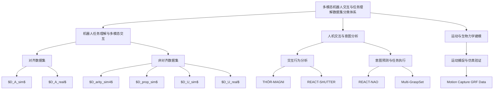

```mermaid
graph TD
    A[多模态机器人交互与任务理解数据集分类体系] --> B[机器人任务理解与多模态交互]
    A --> C[人机交互与意图分析]
    A --> D[运动与生物力学建模]
    B --> E[对齐数据集]
    B --> F[非对齐数据集]
    E --> G[ $D_A_sim$ ]
    E --> H[ $D_A_real$ ]
    F --> I[$D_arity_sim4$]
    F --> J[$D_prop_sim$]
    F --> K[$D_U_sim$]
    F --> L[$D_U_real$]
    C --> M[交互行为分析]
    C --> N[意图预测与任务执行]
    M --> O[THÖR-MAGNI]
    M --> P[REACT-SHUTTER]
    N --> Q[REACT-NAO]
    N --> R[Multi-GraspSet]
    D --> S[运动捕捉与仿真验证]
    S --> T[Motion Capture GRF Data]
```
