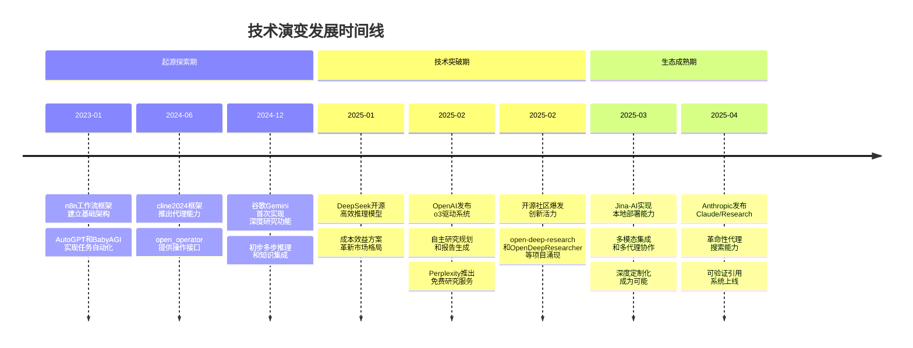

```mermaid
timeline
    title 技术演变发展时间线
    dateFormat  YYYY-MM
    axisFormat  %Y-%m

    section 起源探索期
    2023-01 : n8n工作流框架<br>建立基础架构
           : AutoGPT和BabyAGI<br>实现任务自动化
    2024-06 : cline2024框架<br>推出代理能力
           : open_operator<br>提供操作接口
    2024-12 : 谷歌Gemini<br>首次实现<br>深度研究功能
           : 初步多步推理<br>和知识集成

    section 技术突破期  
    2025-01 : DeepSeek开源<br>高效推理模型
           : 成本效益方案<br>革新市场格局
    2025-02 : OpenAI发布<br>o3驱动系统
           : 自主研究规划<br>和报告生成
           : Perplexity推出<br>免费研究服务
    2025-02 : 开源社区爆发<br>创新活力
           : open-deep-research<br>和OpenDeepResearcher<br>等项目涌现

    section 生态成熟期
    2025-03 : Jina-AI实现<br>本地部署能力
           : 多模态集成<br>和多代理协作
           : 深度定制化<br>成为可能
    2025-04 : Anthropic发布<br>Claude/Research
           : 革命性代理<br>搜索能力
           : 可验证引用<br>系统上线
```
