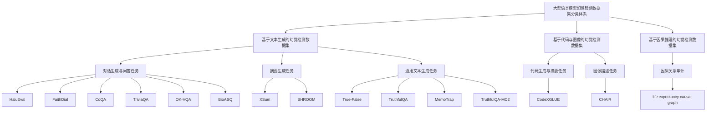

```mermaid
graph TD
A[大型语言模型幻觉检测数据集分类体系] --> B[基于文本生成的幻觉检测数据集]
A --> C[基于代码与图像的幻觉检测数据集]
A --> D[基于因果推理的幻觉检测数据集]
B --> E[对话生成与问答任务]
B --> F[摘要生成任务]
B --> G[通用文本生成任务]
E --> H[HaluEval]
E --> I[FaithDial]
E --> J[CoQA]
E --> K[TriviaQA]
E --> L[OK-VQA]
E --> M[BioASQ]
F --> N[XSum]
F --> O[SHROOM]
G --> P[True-False]
G --> Q[TruthfulQA]
G --> R[MemoTrap]
G --> S[TruthfulQA-MC2]
C --> T[代码生成与摘要任务]
C --> U[图像描述任务]
T --> V[CodeXGLUE]
U --> W[CHAIR]
D --> X[因果关系审计]
X --> Y[life expectancy causal graph]
```
