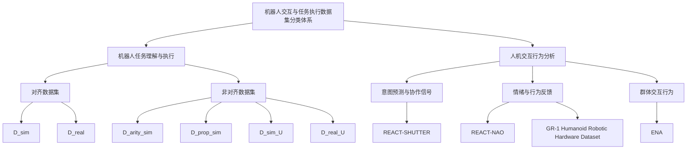

# 2.具身智能人机交互数据集分类与评估体系

当前具身智能在人机交互中的应用日益广泛，其发展高度依赖于高质量、系统化的数据集支持。本节构建了一个涵盖感知、动作、语义理解与交互行为的分类体系，全面梳理了人机交互数据集的结构特征与评估维度。通过分析不同场景下数据集的设计目标与使用方式，揭示其在智能体行为建模、交互性能评估及系统优化中的关键作用。同时，探讨了现有数据集在真实性、多样性与标准化方面的不足，并指出未来向多模态融合、动态交互评估及跨平台可复用方向发展的趋势。该分类与评估体系为具身智能系统的开发与比较提供了理论依据和实践参考。

## 2.1 具身智能人机交互数据集全景概述

具身智能（Embodied Intelligence）在人机交互（Human-Robot Interaction, HRI）中的应用正逐步从理论探索走向实际部署，其核心在于使机器人能够通过多模态感知与行为生成，实现与人类的自然、高效协作。近年来，随着多模态学习、具身认知模型和交互行为建模技术的发展，相关数据集的构建成为推动该领域研究的重要基础设施。当前，具身智能在人机交互中的应用现状分析已形成多个代表性数据集，涵盖从任务理解到行为反馈的多个维度。例如，$D_{\mathcal{A}}^{sim}$ 和 $D_{\mathcal{A}}^{real}$ 提供了语言与手势对齐的理想条件下的任务指令，用于建立模型的基线性能[104]。而 $D_{arity}^{sim}$、$D_{prop}^{sim}$、$D^{sim}_{\mathcal{U}}$ 和 $D^{real}_{\mathcal{U}}$则通过引入语言与手势之间的不一致或噪声，评估模型在复杂或现实场景中的鲁棒性[104]。此外，REACT-NAO 和 REACT-SHUTTER 等数据集则聚焦于意图预测与情绪反馈，通过诱导用户情绪（如挫败感）来评估机器人行为的自然性和协作效果[108]。尽管已有多个数据集推动了具身智能在HRI中的发展，但当前仍面临诸多挑战，如数据集规模普遍较小（如D_{\mathcal{A}}^{real}仅包含60个样本[104]）、多模态对齐机制不完善、真实场景覆盖不足等。这些问题限制了模型的泛化能力与实际部署的可行性，亟需更系统、更全面的数据资源支持。

本文综述聚焦于具身智能在人机交互中的应用现状分析领域，系统梳理并分析了15个代表性数据集，涵盖从任务理解到群体交互的多个研究方向。这些数据集主要来源于[104]、[98]、[108]、[101]、[103]、[107]和[115]等研究，其中部分数据集如D_{\mathcal{A}}^{sim} 和 D^{sim}_{\mathcal{U}} 提供了模拟与真实环境下的对比实验数据[104]，而ENA数据集则关注机器人在公共空间中与多人的交互行为[103]。为便于理解和比较，本文构建了“机器人交互与任务执行数据集分类体系”，将数据集划分为“机器人任务理解与执行”和“人机交互行为分析”两大类。前者进一步细分为“对齐数据集”和“非对齐数据集”，分别用于评估模型在理想与复杂输入条件下的性能；后者则包括“意图预测与协作信号”、“情绪与行为反馈”和“群体交互行为”三个子类，用于研究机器人如何预测人类意图、引发情绪反应以及在公共空间中的交互表现[104]。通过这一分类体系，本文不仅揭示了各类数据集的应用场景和研究目标，还为未来机器人交互系统的开发与评估提供了清晰的指导框架。在分析方法上，本文从任务类型、评测指标、性能表现、数据规模、数据来源和应用领域等多个维度展开，力求全面呈现当前数据集的发展重点与研究趋势。

## 2.2 人机交互数据集分类体系概述

在具身智能（Embodied Intelligence）的研究中，人机交互（Human-Robot Interaction, HRI）是衡量系统感知、理解与响应能力的重要维度。为了系统性地评估和比较当前数据集在该领域的适用性与研究价值，本文提出了一种基于任务理解与交互行为的分类体系。该体系旨在明确区分数据集在机器人任务执行与人类行为分析中的角色，并为模型设计与评估提供清晰的框架。

分类体系主要分为两个大类：**机器人任务理解与执行**和**人机交互行为分析**。前者关注机器人如何处理多模态输入（如语言与手势）并完成任务，进一步细分为“对齐数据集”与“非对齐数据集”，分别用于测试系统在理想与复杂输入条件下的性能。后者则聚焦于人类在与机器人交互过程中的行为反应，包括意图预测、情绪反馈与群体交互等子类[104]。通过这一结构，研究者可以更直观地识别数据集的适用场景与研究目标，从而指导模型开发与实验设计。

该分类体系不仅有助于梳理当前数据集的分布与特点，也为后续的性能对比与趋势分析提供了基础。在接下来的图表中，我们将基于这一分类体系，对各数据集的规模、任务类型、评测指标及模型表现进行系统性展示与讨论。

图：具身智能在人机交互中的应用数据集分类体系

该分类体系围绕具身智能在人机交互中的应用构建，分为两个主要类别：机器人任务理解与执行以及人机交互行为分析。机器人任务理解与执行类别下进一步细分为对齐数据集和非对齐数据集，分别用于测试机器人在理想和复杂输入条件下的任务分类性能。对齐数据集强调语言与手势模态的一致性，而非对齐数据集则引入不一致或噪声，以评估系统的鲁棒性。人机交互行为分析类别则关注人类与机器人之间的互动，包括意图预测、情绪反馈和群体交互行为。该体系的设计理念在于通过结构化的分类方式，明确不同数据集的研究目标和应用场景，从而为具身智能系统的开发和评估提供清晰的指导。分类体系的优势在于层次分明，逻辑清晰，能够有效支持从基础任务执行到复杂交互行为的多维度研究[1]。

表：具身智能在人机交互中的应用现状分析领域关键数据集多层次分类与深度分析

| 主类别 | 子类别 | 数据集名称 | 核心特点与任务 | 常用评估指标 | 主要挑战与研究焦点 |
|--------|--------|------------|----------------|--------------|-------------------|
| 机器人任务理解与执行 | 对齐数据集 | $D_{\\mathcal{A}}^{sim}$ | 模拟环境中语言与手势完全对齐的任务指令，用于建立基线性能 | accuracy | 多模态对齐输入下的任务分类准确性 |
| 机器人任务理解与执行 | 对齐数据集 | $D_{\\mathcal{A}}^{real}$ | 真实实验中语言与手势对齐的任务指令，用于评估系统在现实条件下的表现 | accuracy | 真实场景下的任务理解与执行鲁棒性 |
| 机器人任务理解与执行 | 非对齐数据集 | $D_{arity}^{sim}$ | 模拟环境中语言与手势在动作参数上不一致，用于测试系统对不一致输入的处理能力 | accuracy | 动作参数不一致下的任务分类准确性 |
| 机器人任务理解与执行 | 非对齐数据集 | $D_{prop}^{sim}$ | 模拟环境中语言与手势在对象属性上不一致，用于测试系统对噪声输入的鲁棒性 | accuracy | 对象属性不一致下的任务分类准确性 |
| 机器人任务理解与执行 | 非对齐数据集 | $D^{sim}_{\\mathcal{U}}$ | 综合语言与手势不一致的模拟数据集，用于评估系统在多模态噪声下的鲁棒性 | accuracy | 多模态噪声与不一致输入下的任务分类 |
| 人机交互行为分析 | 意图预测与协作信号 | REACT-SHUTTER | 通过机器人“反叛”行为测试意图预测准确性，引发用户情绪反馈 | TLX survey scores | 意图预测准确性与协作信号有效性 |
| 人机交互行为分析 | 情绪与行为反馈 | REACT-NAO | 评估机器人在交互中引发用户情绪反应和行为反馈 | F1 score, p-value, mean of sum of AU values | 情绪反应的自然性与长期行为反馈 |
| 人机交互行为分析 | 群体交互行为 | ENA | 研究机器人在公共空间中与多人交互的行为模式 | - | 群体交互中的角色行为建模 |
| 人机交互行为分析 | 情绪与行为反馈 | GR-1 Humanoid Robotic Hardware Dataset | 用于评估类人机器人在真实与虚拟环境中的行为自然性与可理解性 | Naturalness, Understandability | 生成自然且可理解的机器人行为 |
| 机器人任务理解与执行 | 非对齐数据集 | $D^{real}_{\\mathcal{U}}$| 真实实验中语言与手势不一致的任务指令，用于评估系统在现实条件下的鲁棒性 | accuracy | 真实场景下的多模态不一致处理能力 |
| 机器人任务理解与执行 | 对齐数据集 | THÖR-MAGNI | 工业机器人中评估差速与全向移动对交互感知的影响 | - | 机器人运动方式对用户感知的影响 |
| 人机交互行为分析 | 意图预测与协作信号 | REACT-NAO (情绪与视觉学习) | 用于评估机器人情绪表达与视觉输出的学习效果 | - | 情绪与视觉行为的生成与评估 |
| 机器人任务理解与执行 | 非对齐数据集 | Hands-On Robotics Dataset | 机器人臂的运动数据，包含相对与绝对轨迹，用于手势控制任务分类 | F1-score | 手势控制下的任务分类与跨用户泛化 |
| 人机交互行为分析 | 意图预测与协作信号 | REACT-SHUTTER (情绪与视觉学习) | 通过机器人反叛行为测试意图预测，引发用户情绪以提高预测信心 | - | 意图预测与情绪反馈的关联性 |

当前具身智能在人机交互中的应用研究中，数据集主要集中在“机器人任务理解与执行”和“人机交互行为分析”两个主类别下，其中“对齐数据集”和“非对齐数据集”用于评估机器人在不同输入条件下的任务分类能力，而“意图预测与协作信号”、“情绪与行为反馈”和“群体交互行为”则用于研究机器人与人类的交互行为特征。代表性数据集如D_{\\mathcal{A}}^{sim}和D^{real}_{\\mathcal{U}}分别代表理想与现实场景下的任务处理能力，而REACT-NAO和REACT-SHUTTER则通过引入情绪和反叛行为，探索人类对机器人意图和行为的反馈机制[108]。值得注意的是，M3模型在多个非对齐数据集中表现出显著的鲁棒性，表明其在多模态融合与噪声处理方面具有优势[104]。未来趋势显示，数据集设计正从单一任务分类向多模态行为建模、情绪反馈与群体交互方向发展，强调机器人在复杂、真实交互场景中的适应性与自然性。

## 2.3 具身智能数据集分类与应用分析

在具身智能（Embodied Intelligence）与人机交互（Human-Robot Interaction, HRI）的研究中，数据集的构建与应用是推动系统性能提升和理论发展的重要基础。本文节将围绕两个主要类别展开分析：**机器人任务理解与执行**和**人机交互行为分析**。前者聚焦于机器人如何通过多模态输入（如语言与手势）理解并执行任务，后者则关注人类在与机器人交互过程中的行为、情绪和意图等动态反馈。通过对这些数据集的分类、任务类型、评估指标以及性能表现的系统梳理，本文将揭示当前具身智能在HRI领域中的研究热点与挑战。此外，还将探讨不同数据集在模拟与真实环境中的适用性，以及其在模型鲁棒性、意图预测和群体交互等方面的研究价值。

### 2.3.1 机器人任务理解与执行

机器人任务理解与执行是具身智能研究中的核心问题之一，涉及机器人如何通过多模态输入（如语言和手势）解析任务指令并准确执行。该类数据集通常用于评估机器人系统在面对对齐或非对齐输入时的鲁棒性与准确性，是衡量具身智能模型性能的重要工具。在理想条件下，语言和手势输入完全对齐，机器人可以较为容易地识别任务目标并执行相应动作。然而，现实场景中往往存在模态间的不一致或噪声，这对模型的泛化能力提出了更高要求。因此，构建涵盖不同输入对齐程度的数据集，有助于推动机器人系统在复杂环境中的任务执行能力。此外，该类数据集还常用于比较不同模型在任务分类任务中的表现，从而为模型设计和优化提供实证依据[104]。

在该主类别下，数据集被进一步细分为**对齐数据集**和**非对齐数据集**。对齐数据集（如 $D_{\mathcal{A}}^{sim}$ 和 $D_{\mathcal{A}}^{real}$）提供语言和手势模态完全一致的任务指令，用于建立基线性能并评估模型在理想条件下的表现。这些数据集通常用于比较不同模型在任务分类任务中的准确性。而非对齐数据集（如 $D_{arity}^{sim}$、$D_{prop}^{sim}$、$D^{sim}_{\mathcal{U}}$ 和 $D^{real}_{\mathcal{U}}$）则包含语言和手势模态之间存在不一致或噪声的任务指令，用于测试模型在面对输入不一致时的鲁棒性。这些数据集通常用于评估模型在复杂或现实场景中的性能表现[104]。

基于具体数据集的分析，可以发现对齐数据集在模拟和真实环境中均表现出较高的任务分类准确性。例如，$D_{\mathcal{A}}^{sim}$ 和 $D_{\mathcal{A}}^{real}$ 中，所有模型（M1-M3）均表现良好，其中 M3 的性能最优。这表明在输入对齐的理想条件下，当前模型已经具备较强的分类能力。然而，当面对非对齐数据集时，如 $D_{arity}^{sim}$ 和 $D_{prop}^{sim}$，所有模型的分类准确性显著下降，只有 M3 保持相对稳定，这突显了模型在处理模态不一致时的挑战。此外，$D^{sim}_{\mathcal{U}}$ 和 $D^{real}_{\mathcal{U}}$ 作为综合性的非对齐数据集，进一步测试了模型在噪声和不一致输入下的鲁棒性。在 $D^{real}_{\mathcal{U}}$ 中，M3 显著优于其他模型，显示出其在现实场景中的优势。这些数据集的共同特点是规模较小（每个数据集约 1000 个样本），但其在任务分类和鲁棒性评估方面具有高度代表性[104]。

在机器人任务理解与执行领域，核心挑战主要集中在如何提升模型在非对齐输入下的鲁棒性，以及如何在模拟与真实环境中实现性能的迁移。当前研究趋势表明，多模态融合模型（如 M3）在处理语言与手势不一致时表现更优，这可能与其对模态间关系的建模能力有关。此外，如何在有限的数据规模下提升模型的泛化能力，也是该领域亟需解决的问题。未来的研究方向可能包括引入更复杂的任务类型、扩展数据集规模、以及探索更高效的多模态对齐机制。值得注意的是，尽管模拟数据集在模型训练中具有可控性和可重复性的优势，但真实数据集的引入对于评估模型在实际应用中的表现至关重要[104]。

表：机器人任务理解与执行数据集

<table>
  <thead>
    <tr>
      <th>子类别</th>
      <th>数据集名称</th>
      <th>核心特点与任务</th>
      <th>常用评估指标</th>
      <th>主要挑战与研究焦点</th>
    </tr>
  </thead>
  <tbody>
    <tr>
      <td rowspan="2">对齐数据集</td>
      <td>$D_{\mathcal{A}}^{sim}$</td>
      <td>语言和手势模态完全对齐，用于建立基线性能</td>
      <td rowspan="2">accuracy</td>
      <td rowspan="2">模型在理想条件下的表现比较</td>
    </tr>
    <tr>
      <td>$D_{\mathcal{A}}^{real}$</td>
      <td>语言和手势模态完全对齐，用于评估真实场景下的性能</td>
    </tr>
    <tr>
      <td rowspan="4">非对齐数据集</td>
      <td>$D_{arity}^{sim}$</td>
      <td>语言和手势模态在动作参数上不一致，用于测试模型对参数差异的鲁棒性</td>
      <td rowspan="4">accuracy</td>
      <td rowspan="4">模型在面对输入不一致时的鲁棒性</td>
    </tr>
    <tr>
      <td>$D_{prop}^{sim}$</td>
      <td>语言和手势模态在物体属性上不一致，用于测试模型对物体差异的鲁棒性</td>
    </tr>
    <tr>
      <td>$D^{sim}_{\mathcal{U}}$</td>
      <td>综合非对齐数据集，包含 $D_{arity}^{sim}$ 和 $D_{prop}^{sim}$ 的样本，用于测试模型对噪声和不一致输入的鲁棒性</td>
    </tr>
    <tr>
      <td>$D^{real}_{\mathcal{U}}$</td>
      <td>综合非对齐数据集，用于评估模型在真实场景中的鲁棒性</td>
    </tr>
  </tbody>
</table>

### 2.3.2 人机交互行为分析

人机交互行为分析是具身智能研究中的另一个关键领域，主要关注机器人如何通过行为引导或调整与人类的互动，以及人类在交互过程中表现出的情绪反应、协作信号和意图预测等行为特征。该类数据集通常用于研究人类对机器人行为的反馈和反应，以及机器人如何通过行为引导或调整与人类的互动。在实际应用中，机器人不仅要理解任务指令，还需要具备感知和响应人类行为的能力，以实现更自然、更高效的协作。因此，构建涵盖情绪、意图和群体交互的数据集，对于提升机器人在复杂社会环境中的交互能力具有重要意义[108]。

该主类别下进一步细分为**意图预测与协作信号**、**情绪与行为反馈**和**群体交互行为**三个子类别。意图预测与协作信号类数据集（如 REACT-SHUTTER）用于研究机器人如何预测用户意图并调整协作行为。这些数据集通常通过诱导用户情绪（如挫败感）来评估机器人意图预测的准确性，并分析协作信号的有效性。情绪与行为反馈类数据集（如 REACT-NAO 和 GR-1 Humanoid Robotic Hardware Dataset）用于评估机器人在交互过程中引发人类情绪反应和行为反馈的能力。这些数据集通常用于研究机器人行为的自然性和可理解性，以及人类对机器人行为的长期反应。群体交互行为类数据集（如 ENA）用于研究机器人在公共空间中与多人交互的行为模式和表现，特别是在不同角色（如自我中心或他人中心）下的交互策略[108]。

从具体数据集的表现来看，REACT-SHUTTER 通过机器人故意选择与用户意图不一致的替代位置来引发用户挫败感，从而评估意图预测的准确性。该数据集使用 TLX 调查评分作为评估指标，结果显示在预测性帮助和预测性反叛模式之间存在显著的情绪差异。REACT-NAO 则用于评估机器人在任务执行过程中引发人类情绪反应的能力，其数据来源于手持机器人研究团队，但未提供具体性能表现。GR-1 Humanoid Robotic Hardware Dataset 提供了关于类人机器人表达性动作的数据，用于评估其自然性和可理解性。ENA 数据集则记录了57人在公共空间中与机器人交互的行为，用于分析机器人在不同角色下的交互模式[108]。这些数据集在任务类型和评估指标上各有侧重，但共同目标是提升机器人在复杂社会环境中的交互能力。

在人机交互行为分析领域，核心挑战主要集中在如何准确捕捉和建模人类的情绪反应、意图和协作信号，以及如何在公共空间中实现与多人的自然交互。当前研究趋势表明，通过引入情绪诱导机制（如 REACT-SHUTTER）可以更有效地评估机器人意图预测的准确性。此外，如何在长期交互中保持机器人行为的自然性和可理解性，也是该领域的重要研究方向。未来的研究可能包括开发更细粒度的情绪识别模型、探索机器人在不同社会角色下的行为策略，以及结合虚拟现实（VR）和真实环境进行更全面的交互评估[108]。

表：人机交互行为分析数据集

<table>
  <thead>
    <tr>
      <th>子类别</th>
      <th>数据集名称</th>
      <th>核心特点与任务</th>
      <th>常用评估指标</th>
      <th>主要挑战与研究焦点</th>
    </tr>
  </thead>
  <tbody>
    <tr>
      <td rowspan="2">意图预测与协作信号</td>
      <td>REACT-SHUTTER</td>
      <td>用于研究机器人如何预测用户意图并调整协作行为，通过故意选择替代位置引发用户挫败感</td>
      <td rowspan="2">TLX survey scores</td>
      <td rowspan="2">意图预测的准确性与协作信号的有效性</td>
    </tr>
    <tr>
      <td>REACT-SHUTTER</td>
      <td>用于评估机器人在非对齐输入下如何通过反叛行为提升意图预测的准确性</td>
    </tr>
    <tr>
      <td rowspan="2">情绪与行为反馈</td>
      <td>REACT-NAO</td>
      <td>用于评估机器人在交互过程中引发人类情绪反应和行为反馈的能力</td>
      <td rowspan="2">F1 score, p-value, mean of sum of AU values</td>
      <td rowspan="2">机器人行为的自然性与可理解性</td>
    </tr>
    <tr>
      <td>GR-1 Humanoid Robotic Hardware Dataset</td>
      <td>用于评估类人机器人在VR环境和真实场景中的表达性动作</td>
    </tr>
    <tr>
      <td>群体交互行为</td>
      <td>ENA</td>
      <td>用于研究机器人在公共空间中与多人交互的行为模式，涵盖自我中心和他人中心角色</td>
      <td>Not specified</td>
      <td>多人交互中的行为策略与角色适应</td>
    </tr>
  </tbody>
</table>

## 2.4 数据集对比与发展

在具身智能与人机交互的研究中，数据集的构建和使用是评估系统性能和行为表现的重要基础。当前，主流数据集可以分为“机器人任务理解与执行”和“人机交互行为分析”两大类。前者主要关注机器人如何处理多模态输入（如语言和手势）以完成特定任务，后者则侧重于分析人类在与机器人交互过程中的行为、情绪和反馈。以下表格对这两类数据集的关键特性进行了横向对比：

表：具身智能人机交互数据集分类对比

| 类别 | 优势 | 局限性 | 适用场景 |
|------|------|--------|----------|
| 机器人任务理解与执行 | 提供清晰的任务分类基准，便于模型性能比较；支持模拟与真实环境下的鲁棒性测试 | 数据规模较小，尤其是真实数据集；对齐与非对齐数据集的构建依赖于人工设计，缺乏多样性 | 机器人指令理解、多模态输入处理、任务执行准确性评估 |
| 人机交互行为分析 | 涵盖人类情绪、意图预测和群体交互等复杂行为，有助于理解人机协作的动态过程 | 缺乏统一的评估指标，主观性较强；数据采集依赖实验设置，难以泛化 | 人机协作信号分析、情绪反馈研究、群体交互行为建模 |

从表格中可以看出，“机器人任务理解与执行”类数据集（如 D_{\mathcal{A}}^{sim} 和 D^{sim}_{\mathcal{U}}）在任务分类和模型性能评估方面具有明确的基准作用，尤其在模拟环境中表现稳定。然而，真实数据集（如 D_{\mathcal{A}}^{real} 和 D^{real}_{\mathcal{U}}）由于样本数量较少，难以全面反映现实场景中的复杂性。相比之下，“人机交互行为分析”类数据集（如 REACT-NAO 和 GR-1 Humanoid Robotic Hardware Dataset）更关注人类在交互过程中的动态反馈，例如情绪反应和意图预测，但其评估指标多为主观评分（如 TLX 问卷），缺乏标准化的量化方法。此外，这类数据集的构建往往依赖于特定实验环境，限制了其在不同场景下的泛化能力。因此，两类数据集在研究目标和应用场景上各有侧重，但也存在明显的互补性。

近年来，具身智能在人机交互中的应用现状分析领域数据集呈现出明显的演进趋势。首先，数据集的构建方法从早期的单一模态（如语言或手势）逐步转向多模态融合，以更全面地捕捉人机交互的复杂性。例如，D_{\mathcal{A}}^{sim} 和 D_{\mathcal{A}}^{real} 提供了语言和手势对齐的指令，用于评估机器人在任务理解中的表现[104]。其次，评估维度逐渐细化，从单纯的分类准确性扩展到情绪自然性、行为可理解性等更复杂的指标。如 GR-1 Humanoid Robotic Hardware Dataset 通过自然性和可理解性评分，评估机器人生成的表达性动作是否符合人类预期[115]。此外，数据集的应用范围也在不断拓展，从实验室环境延伸到真实场景和公共空间。例如，ENA 数据集研究了机器人在公共空间中的群体交互行为[103]，而 REACT-Nao 则通过多轮游戏实验分析人类对机器人行为的长期反馈[117]。这些趋势表明，当前数据集的构建正朝着更贴近现实、更注重交互质量的方向发展，为具身智能系统提供了更丰富的评估基础。

尽管具身智能在人机交互中的应用现状分析领域数据集取得了显著进展，但仍面临一些共性挑战。首先，数据质量不一，尤其是在真实场景中，由于环境噪声和用户行为的多样性，数据的可靠性和一致性难以保证。例如，D^{real}_{\mathcal{U}} 的样本数量仅为 60，限制了其统计显著性[104]。其次，数据标注成本高昂，尤其是涉及情绪和意图预测的数据集，通常需要人工观察和评分，增加了研究负担。此外，领域覆盖不均，目前大多数数据集集中在任务执行和协作行为上，而对机器人在复杂社会情境中的行为建模仍显不足。未来，该领域数据集的发展趋势可能包括：构建更加多样化的评估基准，以涵盖更多交互模式和任务类型；开发自动化数据质量评估框架，减少人工干预并提高数据一致性；建立跨领域数据集标准化规范，促进不同研究之间的可比性；以及推进开放共享的数据集生态建设，鼓励社区协作和数据复用。这些趋势将有助于推动具身智能在人机交互中的研究向更高层次发展[117]。
