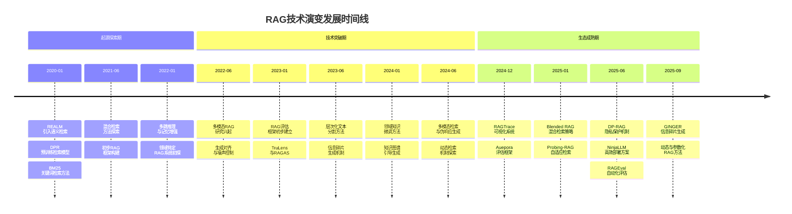

# 1.检索增强生成的范式演进与理论基础

本章系统梳理了检索增强生成（RAG）技术从早期基于规则的检索与生成分离模式，到现代基于深度学习的端到端融合范式的演进历程。首先回顾了传统生成模型在知识更新与准确性方面的局限性，引出将外部知识库纳入生成过程的必要性。随后，探讨了信息检索技术的发展如何为RAG提供支撑，以及生成模型架构的演进如何推动检索与生成的深度融合。在此基础上，分析了RAG技术的核心理论基础，包括知识融合机制、上下文建模与模型可解释性等关键问题。通过梳理其历史脉络与技术转折点，揭示了RAG作为连接静态知识与动态生成能力的新兴范式所蕴含的深层逻辑，为后续研究进展与应用分析奠定坚实基础。

## 1.1 检索增强生成技术的定义和范围

检索增强生成（Retrieval-Augmented Generation, RAG）是一种结合外部知识检索与文本生成的混合型人工智能技术，旨在通过引入实时或领域相关的外部信息，增强大型语言模型（LLMs）在生成任务中的事实准确性、上下文相关性与适应性。其核心机制在于利用检索器从外部知识库中获取与当前任务相关的文档片段，再由生成器基于这些检索结果生成自然语言输出，从而弥补LLMs因依赖静态训练数据而产生的知识过时、领域适应性差及生成幻觉等问题[1][8][18]。RAG的典型流程通常包括预检索、检索、后检索和生成四个阶段，涉及查询编码、文档检索、上下文过滤与排序、以及最终的生成模型输出[8][12][15]。近年来，RAG技术在问答系统、对话生成、摘要生成、文本到SQL转换、代码生成等多个自然语言处理任务中展现出显著优势，成为提升LLMs实用性和可信度的重要手段[2][13][14]。

与传统生成模型相比，RAG通过引入外部知识检索机制，显著提升了生成内容的可靠性与动态适应能力。传统生成模型依赖于训练时所摄入的语料，难以应对训练数据之外的新知识或实时变化的信息，而RAG则通过检索器动态获取最新或特定领域的知识，使生成结果更具时效性与准确性[1][18]。此外，RAG还与知识密集型任务中的其他增强方法（如知识图谱引导、差分隐私保护、多模态信息整合）形成互补关系。例如，KG²RAG通过知识图谱扩展检索结果，提升生成的逻辑性与事实性[14]；DP-RAG则在检索与生成过程中引入差分隐私机制，以保障敏感信息不被泄露[20]；而Probing-RAG通过分析模型内部表示，实现自适应的检索决策，减少冗余检索步骤[22]。这些变体方法在不同应用场景中进一步拓展了RAG的能力边界，使其在复杂推理、隐私保护与多模态处理等方面具备更强的适应性[12][14][20]。

在应用范围与技术边界方面，RAG技术已广泛应用于多个知识密集型领域，包括但不限于开放域问答、医疗咨询、法律推理、金融分析、教育辅导及个性化推荐系统等[2][10][13]。其技术核心由高效的检索机制、精准的生成控制以及知识与模型之间的有效融合构成，支持系统在面对动态知识环境时仍能保持较高的生成质量与可解释性[11][18][21]。然而，RAG的性能高度依赖于检索模块的质量与效率，如何在大规模语料中快速、准确地获取相关信息仍是关键挑战之一[12][15]。此外，检索结果与生成内容之间的对齐问题、生成模型对噪声信息的敏感性、以及多模态与跨语言场景下的适应性，也限制了RAG在更广泛任务中的部署[4][11][16]。因此，当前研究不仅关注检索与生成模块的优化，还致力于探索更智能的模块协同机制、更全面的评估体系以及更高效的部署方案，以推动RAG在实际应用中的持续演进与落地[7][16][17]。

## 1.2 检索增强生成技术的历史背景和技术演变

检索增强生成（Retrieval-Augmented Generation, RAG）技术作为连接外部知识与生成模型的重要桥梁，其发展背景可以追溯到大型语言模型（LLMs）在事实准确性、领域适应性和实时信息处理方面的局限性。随着LLMs在自然语言处理任务中的广泛应用，其依赖静态训练数据的特性逐渐暴露出知识过时、幻觉生成和领域知识不足等问题[8]。为了解决这些问题，研究者开始探索如何将外部知识检索机制引入生成流程，以增强模型的推理能力和输出质量。这一探索不仅推动了RAG技术的诞生，也促使了其在多个子领域中的快速发展，如问答系统、对话生成、文本摘要、代码生成等[1]。RAG通过结合检索器（retriever）和生成器（generator）两个核心模块，使得模型能够在生成过程中动态获取并整合外部知识，从而在多个任务中展现出优于纯生成模型的性能[2]。早期的RAG系统多采用基于关键词的检索方法（如BM25）和传统的生成模型（如T5、BART），其结构较为简单，但已经初步展示了结合检索与生成的优势[12]。与此同时，研究者也意识到RAG系统在知识选择、检索效率、生成对齐等方面存在诸多挑战，这为后续技术的演进提供了明确的研究方向[9]。

**起源与早期探索阶段（2020年-2022年）**见证了RAG技术的初步构建与概念验证。在这一阶段，研究者开始尝试将信息检索技术与生成模型相结合，以解决LLMs在事实生成中的不足。例如，早期的混合模型（hybrid models）尝试通过关键词匹配和语义检索的结合，提升检索结果的相关性[12]。同时，一些基础性的RAG框架被提出，如REALM和DPR，它们分别通过密集向量检索和预训练检索模型为生成任务提供支持[2]。这些方法虽然在生成质量上有所提升，但受限于检索效率和生成模型的融合机制，尚未形成系统性的解决方案。此外，研究者还开始关注RAG在特定任务中的表现，如问答系统和对话生成，初步验证了其在提升上下文相关性和事实准确性方面的潜力[1]。值得注意的是，这一阶段的研究多集中于模型结构的构建和检索方法的优化，而对生成过程的控制和评估体系的建立尚未深入[4]。例如，一些研究指出，生成器在整合检索结果时容易引入噪声或忽略关键信息，这成为RAG系统设计中的早期挑战之一[11]。尽管如此，这些初步探索为后续RAG技术的演进奠定了坚实基础，并激发了学术界和工业界对RAG的广泛关注[8]。

**技术突破与多样化发展阶段（2022年-2024年）**标志着RAG技术在模型结构、检索策略和生成控制方面的显著进步。研究者开始探索更复杂的检索与生成协同机制，以提升系统的整体性能。例如，多跳推理（multi-hop reasoning）和记忆增强（memory augmentation）技术被引入RAG系统，使得模型能够处理更复杂的任务，如跨文档推理和长文本生成[1]。与此同时，多模态知识整合成为研究热点，一些工作尝试将视觉、音频等非文本信息纳入RAG流程，以增强模型在视觉问答和跨模态生成任务中的表现[7]。此外，RAG的评估体系也逐步建立，研究者提出了多个评估框架，如RAGAS和TruLens，用于衡量检索与生成模块的协同效果[6]。这一阶段的另一个重要进展是领域特定RAG系统的开发，如DuetRAG和KG²RAG，它们通过引入领域知识微调和知识图谱引导，显著提升了模型在医疗、法律等专业领域的准确性[10][14]。值得注意的是，研究者还开始关注RAG系统的部署效率和计算成本，提出了一些优化方法，如基于层次化文本分割的RAG改进框架[15]。这些技术突破不仅提升了RAG的实用性，也为后续研究提供了丰富的技术基础和应用场景[18]。

**生态系统成熟与前沿探索阶段（2024年至今）**的显著特征是RAG技术的全面成熟与多方向的前沿探索。随着RAG在多个领域的广泛应用，研究者开始关注其在复杂任务中的鲁棒性和可解释性。例如，RAGTrace的提出标志着RAG系统评估进入了一个新的阶段，该工具通过交互式可视化分析，帮助用户全面理解检索与生成过程中的动态关系[21]。与此同时，RAG的评估方法也得到了系统性梳理，Auepora框架的提出为RAG系统的多维度评估提供了统一标准[4]。此外，研究者还提出了多个改进RAG性能的创新方法，如Blended RAG通过融合语义搜索与混合查询策略，提升了检索结果的相关性[12]；Probing-RAG则通过分析模型内部表示，实现自适应检索决策，从而减少不必要的检索步骤[22]。在实际部署方面，NinjaLLM的出现展示了RAG系统的高效性与成本效益，通过优化模型部署和微调方法，实现了在大规模数据集上的先进性能[17]。与此同时，隐私保护也成为RAG研究的重要方向，DP-RAG通过引入差分隐私机制，确保在生成过程中不会泄露敏感信息[20]。这些进展表明，RAG技术已经从单一的生成增强工具演变为一个涵盖多模态、多领域、多任务的综合技术体系，其研究重点也从模型性能提升转向了系统可靠性、可解释性和伦理合规性[11]。未来，RAG有望在更复杂的任务中发挥更大作用，如跨语言检索、动态知识更新和更高效的模块化设计[18]。

图：RAG技术演变时间线

这一技术演变时间线清晰地展示了检索增强生成技术从概念萌芽到系统成熟的发展轨迹。早期的检索与生成结合方法为后续的多跳推理和记忆增强奠定了基础，而中期的技术突破则推动了RAG在多模态、多领域和多任务中的广泛应用。当前，RAG生态系统已趋于成熟，研究重点转向了系统鲁棒性、可解释性和隐私保护等前沿方向。

## 1.3 检索增强生成技术的重要性和实际意义

检索增强生成（Retrieval-Augmented Generation, RAG）技术作为连接外部知识与生成模型的关键桥梁，正在多个关键领域展现出深远的变革性影响和实际价值。这种技术不仅在提升生成模型的事实准确性与上下文相关性方面具有显著优势，更在应对大语言模型（LLMs）的幻觉问题、增强模型的实时性与领域适应性、以及推动多模态与隐私保护等前沿方向上发挥着重要作用。通过系统性地整合外部知识源与模型生成能力，RAG正在重新定义自然语言处理（NLP）任务的边界和可能性，为构建更加智能、可靠和实用的语言模型提供了坚实的技术支撑[1][2][8]。

**在提升生成模型的事实准确性与上下文相关性方面，RAG技术具有不可替代的作用** 。传统生成模型依赖于静态训练数据，难以应对知识更新快、领域知识复杂或任务要求高精度的场景。RAG通过引入外部知识检索机制，使模型能够在生成过程中动态获取最新、最相关的信息，从而显著提升输出内容的事实准确性和上下文适配性[2][8]。例如，在问答系统中，RAG能够结合检索到的权威文档，减少模型因知识过时或缺乏领域知识而产生的错误[10]。在对话系统中，RAG增强了模型对用户意图和上下文的理解，使其能够生成更贴合语境、更具逻辑性的回应[19]。此外，RAG还通过多跳推理和记忆增强技术，提升了模型在处理复杂、多步骤任务时的表现[1]。研究表明，RAG在减少生成模型幻觉问题方面尤为有效，特别是在医疗、法律和金融等对事实准确性要求极高的领域[14][20]。通过将检索与生成模块紧密结合，RAG不仅提高了模型的可信度，也增强了其在实际应用中的实用性[11]。

**在推动大语言模型的实时性、领域适应性与部署效率方面，RAG技术展现出强大的应用潜力** 。随着LLMs在各类任务中的广泛应用，其静态训练数据的局限性日益凸显，尤其是在需要最新信息或特定领域知识的场景中。RAG通过引入外部知识库，使模型能够实时获取所需信息，从而显著提升其在动态环境中的适应能力[17]。例如，在构建个人助手或智能客服系统时，RAG能够根据用户的实时需求检索相关知识，避免因模型知识过时而导致的误导性回答[7]。此外，RAG还为模型的领域迁移提供了有效路径，通过定制化检索器和生成器，模型可以快速适应不同领域的知识结构和语言风格[10][14]。在部署层面，RAG系统通过模块化设计，降低了模型更新和维护的成本，使得企业能够在不重新训练模型的前提下，灵活集成外部知识源[17]。例如，NinjaLLM利用AWS Trainium/Inferentia2芯片实现了高效、低成本的RAG部署，为大规模应用提供了可行的技术方案[17]。这些优势使得RAG成为构建可扩展、可定制、可更新的智能系统的重要技术基础[12][18]。

**在促进多模态生成、增强系统透明性与隐私保护方面，RAG技术正在拓展其应用边界并回应社会关切** 。随着多模态数据的广泛应用，RAG不再局限于文本信息的检索与生成，而是逐步向图像、音频等非文本数据扩展。例如，Blended RAG通过融合语义搜索与混合查询策略，提升了模型在多模态任务中的表现[12]。此外，RAG在生成过程中的知识来源可被明确记录和引用，这为提升模型的透明性和可解释性提供了技术保障[19]。RAGTrace等工具通过可视化手段，使用户能够直观理解模型在生成过程中所依赖的外部知识，从而增强对系统的信任[21]。在隐私保护方面，RAG技术也展现出其社会责任感。DP-RAG通过在检索和生成阶段引入差分隐私机制，有效防止了敏感信息的泄露，为医疗、金融等高隐私敏感领域提供了安全可靠的解决方案[20]。这些进展不仅推动了RAG在技术层面的深化，也回应了社会对AI系统透明性、公平性和隐私保护的日益增长的关注[14][20]。通过在生成过程中引入结构化知识图谱，KG²RAG进一步提升了模型在逻辑推理和事实关联方面的表现[14]，为构建更加智能、安全和可信的AI系统奠定了基础。

RAG技术的重要性和实际意义不仅体现在其对生成模型性能的提升上，更在于其对整个AI系统设计范式和社会应用模式的深刻影响。随着研究的不断深入，RAG在多跳推理、动态知识整合、多模态生成、隐私保护和系统透明性等方面持续取得突破，为构建更加智能、可靠和实用的语言模型提供了坚实的技术支撑。未来，RAG有望在更多复杂任务和实际场景中发挥关键作用，推动AI系统从“黑箱”走向“透明”，从“静态”走向“动态”，从“通用”走向“定制”，从而在科学研究、产业应用和社会服务等多个维度实现更广泛的价值[1][11][18]。
